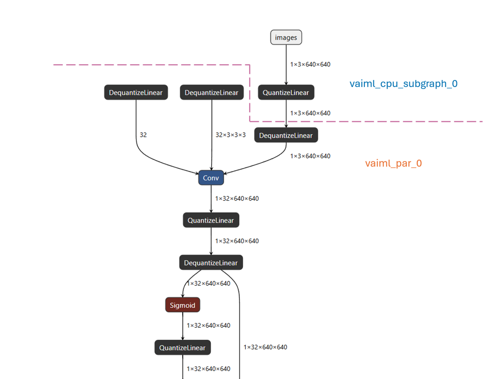
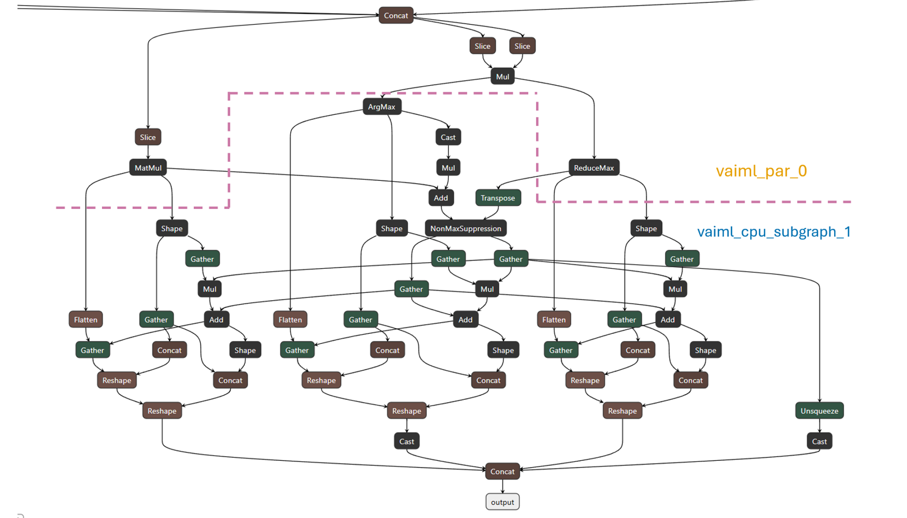
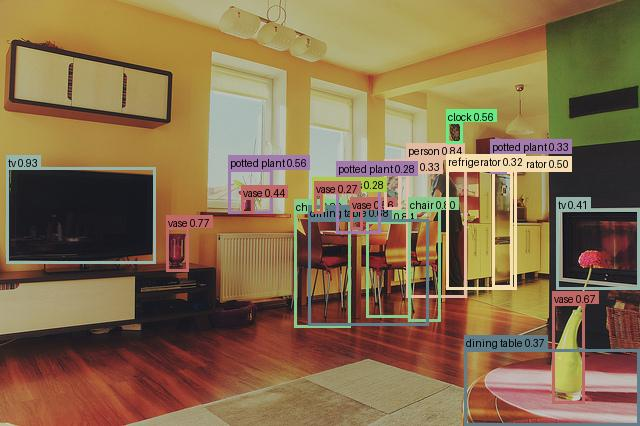

<!--
Copyright (C) 2026 Advanced Micro Devices, Inc.

Licensed under the Apache License, Version 2.0 (the "License"); you may not use this file except in compliance with the License. You may obtain a copy of the License at
http://www.apache.org/licenses/LICENSE-2.0.

Unless required by applicable law or agreed to in writing, software distributed under the License is distributed on an "AS IS" BASIS, WITHOUT WARRANTIES OR CONDITIONS OF ANY KIND, either express or implied. See the License for the specific language governing permissions and limitations under the License.
-->

# Heterogeneous NPU–CPU Inference: YOLOv7 with In-Graph NMS on VEK385

## What is CPU Subgraph Partitioning?

CPU partition support is an advanced AMD Vitis™ AI feature that enables heterogeneous execution of ONNX models across NPU and CPU hardware. The Vitis AI compiler automatically partitions the computational graph into NPU-executable and CPU-executable subgraphs. At runtime, the **VART-ML** (Vitis AI Runtime — ML) orchestrates execution across these partitions — routing tensors between CPU and NPU subgraphs, handling data format conversions at boundaries, and presenting the full graph as a single inference session.

For more detailed understanding of the CPU partition compilation feature, refer to the [CPU Partition Compilation — Vitis AI Documentation](https://vitisai.docs.amd.com/projects/gen2/en/latest/docs/model_compilation/cpu_partition.html).

---

This tutorial demonstrates end-to-end inference of YOLOv7 with in-graph NMS on the **AMD Versal AI Edge Series Gen 2 VEK385 Evaluation Kit**.

YOLOv7 includes a `NonMaxSuppression` (NMS) layer at the end of the detection head — an operator the NPU does not support. Rather than requiring a separate ONNX Runtime fallback, CPU subgraph partitioning handles this automatically: the compute-heavy INT8 backbone runs on the NPU while NMS executes on the CPU via VART-ML Runtime, all within a single inference session.

**Workflow:**

1. Prepare and run Docker environment
2. Export YOLOv7 to ONNX with in-graph NMS
3. Quantize for INT8 mixed-precision deployment
4. Compile for heterogeneous NPU and CPU execution (CPU subgraph partitioning)
5. Deploy to VEK385
6. Prepare input image into model input tensor (`.bin`)
7. Run inference on VEK385 (NPU + CPU subgraphs)
8. Postprocess and validate detection outputs

---

## Prerequisites

The following items are required before starting the tutorial:

- AMD Versal AI Edge Series Gen 2 **VEK385** evaluation kit with network access.
- Linux host with Docker and ~20 GB free disk for models, cache, and intermediate files.
- **Vitis AI 6.2 Docker** image for Versal AI Edge Series Gen 2.
- Network access for one-time downloads (YOLOv7 weights in Step 2, COCO val2017 calibration images in Step 3).
- **`ml_vart`** binary deployed on VEK385 — either the prebuilt binary from the target image or built from source (`../../cpp_examples/ml_vart/README.md`). `ml_vart` is a C++ inference application built on **VART-ML** that loads the compiled `.rai` cache and runs heterogeneous NPU + CPU inference on VEK385.

### Files in this directory

| File                               | Purpose                                                                     |
| ---------------------------------- | --------------------------------------------------------------------------- |
| `export_yolov7_nms_onnx.py`        | Download YOLOv7 and export ONNX (with or without NMS)                       |
| `vitisai_config.json`              | Compiler config for CPU subgraph partitioning and cache passes              |
| `app_config.json`                  | Sample `ml_vart` runtime config                                             |
| `compile.py`                       | Driver for heterogeneous compile (NPU + CPU partitions)                     |
| `quantize_int8.py`                 | INT8 quantization (keeps decode/NMS tail in FP32)                           |
| `prepare_input.py`                 | Convert image to model input binary                                         |
| `postprocess_bin_output.py`        | Decode VART output → detections + annotated image                           |
| `inspect_connectivity_metadata.py` | Display partition connectivity from compiled metadata                       |
| `requirements.txt`                 | Python dependencies (`pip install --no-deps -r requirements.txt` in Docker) |

---

## Step 1 — Prepare and run Docker

Before starting Docker, adjust the access permissions of the working directories on the host machine:

```bash
chmod -R a+w /path/to/cpu_subgraph
cd /path/to/cpu_subgraph
```

Load the latest docker image and launch it as explained in the Vitis AI User Guide for Versal AI Edge Series Gen 2.

When launching Docker for this tutorial, ensure the container uses host networking and bind mounts for the license directory and this tutorial directory (for example, mount this tutorial path to `/cpu_subgraph`).

For additional Docker setup guidance, see [Vitis AI Docker Setup Documentation](https://vitisai.docs.amd.com/projects/gen2/en/latest/docs/setup_and_installation/docker-setup.html).

Inside the docker, enter the mounted workspace and install python dependencies for the scripts in this tutorial:

```bash
cd /cpu_subgraph
pip install --no-deps -r requirements.txt
```

---

## Step 2 — Export YOLOv7 with in-graph NMS (inside Docker)

This export step builds one ONNX graph from YOLOv7 with **`--end2end`**. The **`export_yolov7_nms_onnx.py`** script pulls in the open-source YOLOv7 project and official weights if they are not already present, runs the PyTorch export path, and emits a single ONNX graph. **`--end2end`** forwards YOLOv7's own `--end2end` flag (with `--max-wh` set) to `export.py`, which keeps **`NonMaxSuppression`** inside that graph instead of on the host.

From `/cpu_subgraph`, run:

```bash
python3 export_yolov7_nms_onnx.py --end2end --output yolov7_with_NMS.onnx
```

The command writes **`yolov7_with_NMS.onnx`** to the **current working directory** (for example `/cpu_subgraph` when invoked from that directory).

---

## Step 3 — Quantize the model (inside Docker)

**What this step does:**

This quantization step runs **`quantize_int8.py`** on **`yolov7_with_NMS.onnx`**. The [**AMD Quark**](https://quark.docs.amd.com/latest/index.html) ONNX quantizer **INT8**-quantizes the **heavy backbone** (the conv-heavy region aimed at the NPU) and **keeps the decode / NMS tail in FP32**. The script writes **`yolov7_NMS_MP_Calibrated.onnx`** in the working directory—a mixed-precision ONNX with an INT8 backbone and an FP32 decode/NMS tail.

**Calibration requirement:**

INT8 quantization requires a small representative calibration set (here: 10 COCO val2017 images) to determine quantization scale factors. **`quantize_int8.py`** downloads and extracts **`val2017.zip`** the first time you pass **`--download-val2017`**. The images land in **`./coco/val2017`** under this tutorial directory and are reused on later runs.

From `/cpu_subgraph`, run:

```bash
python3 quantize_int8.py \
  --input yolov7_with_NMS.onnx \
  --output yolov7_NMS_MP_Calibrated.onnx \
  --download-val2017 \
  --max-images 10
```

**If you already have COCO val2017 on disk**, from `/cpu_subgraph`, pass your existing image directory with **`--calib-dir`** instead:

```bash
python3 quantize_int8.py \
  --input yolov7_with_NMS.onnx \
  --output yolov7_NMS_MP_Calibrated.onnx \
  --calib-dir <path-to-coco>/val2017 \
  --max-images 10
```

---

## Step 4 — Compile for heterogeneous NPU and CPU (inside Docker)

This step **compiles** **`yolov7_NMS_MP_Calibrated.onnx`** so the model can run **heterogeneously** on the **NPU** and **CPU** via **VART-ML** on VEK385. **`vitisai_config.json`** turns on CPU subgraph partitioning, and the compiler emits a **`.rai`** cache plus **`connectivity_metadata.json`** that **VART-ML** uses to orchestrate execution across partitions.

For **YOLOv7 with in-graph NMS**, the compiler splits the graph into **three** partitions, executed in this order:

- **`vaiml_cpu_subgraph_0`** (CPU) — input-side processing, like **`QuantizeLinear`**, that prepares tensors consumed by the NPU partition.
- **`vaiml_par_0`** (NPU) — main INT8 compute partition (backbone, neck, and head).
- **`vaiml_cpu_subgraph_1`** (CPU) — output-side FP32 tail that runs **`decode`** and **`NonMaxSuppression`** on NPU outputs.

### How the partition looks in the graph

**`vaiml_cpu_subgraph_0` → NPU (`vaiml_par_0`)**

At this boundary, the input-side CPU subgraph finishes its work (including `QuantizeLinear`) and passes tensors to the NPU partition, where the INT8 backbone begins.



**NPU (`vaiml_par_0`) → `vaiml_cpu_subgraph_1`**

At this boundary, the NPU partition completes the backbone, neck, and head, and passes outputs to the second CPU subgraph, which runs `decode` and `NonMaxSuppression` in FP32.



### Compiler configuration (`vitisai_config.json`)

The provided `vitisai_config.json` uses five passes to enable CPU subgraph partitioning so the compiled graph can be executed by **VART-ML** on VEK385. The order of passes is critical — each pass builds on the previous one:

1. `init` — initializes the compiler environment and validates the model.
2. `vaiml_partition` — identifies NPU-compatible subgraphs.
3. `vaiml_cpu_partition` — assigns unsupported operators to CPU subgraphs.
4. `vaiml_connectivity` — stitches NPU and CPU tensor connections.
5. `vaiml_create_cache` — compiles the NPU subgraph and writes the unified `.rai` cache for VART-ML.

For details on each pass and advanced configuration options, see the [CPU Partition Compilation — Vitis AI Documentation](https://vitisai.docs.amd.com/projects/internal/en/vitis-ai-gen2-6.2-develop/docs/model_compilation/cpu_partition.html).

### Run compilation

````bash
python3 compile.py \
  --model yolov7_NMS_MP_Calibrated.onnx \
  --cache_dir my_cache \
  --cache_key yolov7_NMS_MP_Calibrated \
  --config vitisai_config.json

### Compiler output

Under **`my_cache/yolov7_NMS_MP_Calibrated/`** (from the sample flags above), expect at least:

- **`yolov7_NMS_MP_Calibrated.rai`** — unified compiled model cache for the partitioned graph
- **`connectivity_metadata.json`** — partition order and tensor edges between subgraphs

### Verify partition and compile success

```bash
python3 inspect_connectivity_metadata.py my_cache/yolov7_NMS_MP_Calibrated/connectivity_metadata.json
````

The script prints **`execution_order`** and tensor edges. **For this YOLOv7 build**, that list should show **`vaiml_cpu_subgraph_0`**, then **`vaiml_par_0`**, then **`vaiml_cpu_subgraph_1`**, in order.

---

## Step 5 — Deploy to VEK385

Copy the following files to the target runtime directory on VEK385:

```
my_cache/yolov7_NMS_MP_Calibrated/yolov7_NMS_MP_Calibrated.rai
app_config.json
prepare_input.py
postprocess_bin_output.py
```

On the target (VEK385), install the Python dependencies required by the preprocessing and postprocessing scripts:

```bash
pip3 config set global.trusted-host "pypi.org files.pythonhosted.org pypi.python.org"
pip3 install pillow
```

---

## Step 6 — Prepare input on target

This step normalizes a JPEG image into the input tensor format required by the YOLOv7 model and writes it as a binary file for `ml_vart` to consume during inference.

```bash
python prepare_input.py /etc/vai/models/yolox_m_int8/data/detections.jpg --output-prefix ifm_0
```

> `/etc/vai/models/yolox_m_int8/data/detections.jpg` is a sample image bundled with the VEK385 target image. You can substitute any JPEG.

This generates **`ifm_0.bin`** — a float32 tensor (shape `1×3×640×640`, values `0.0–1.0`) as raw bytes, consumed by `ml_vart` for inference.

---

## Step 7 — Run inference on target

This step runs `ml_vart` against the deployed `.rai` cache to execute heterogeneous NPU + CPU inference on VEK385. The `ml_vart` application requires `app_config.json` to configure the model path, input mappings, and tensor types. This example shows how to configure `app_config.json` for a CPU subgraph partition. For full details of the `ml_vart` application, see [`../../cpp_examples/ml_vart`](../../cpp_examples/ml_vart).

### Inspect the compiled model

Before configuring `app_config.json`, use `--get-model-info` to confirm tensor names, shapes, and boundary types from the compiled `.rai`:

```bash
ml_vart --get-model-info yolov7_NMS_MP_Calibrated.rai
```

Example output:

```text
--- Model info ---
Model file        : yolov7_NMS_MP_Calibrated.rai
Batch size        : 1
  Inputs (1):
    [0] images
         cpu: shape=[1,3,640,640]  dtype=fp32  memory_layout=NCHW  size=4915200B

  Outputs (1):
    [0] output
         cpu: shape=[21600,7]  dtype=fp32  memory_layout=GENERIC(memory_layout_order=[0,1])  size=604800B
```

Use this output to confirm:

- Input tensor name is **`images`** — this must match the `ifms-config` entry in `app_config.json`.
- Output shape is **`[21600, 7]`** — a fixed-capacity detection buffer with rows in **`[batch_id, x1, y1, x2, y2, class_id, confidence]`** format.
  Valid rows are rows containing actual detections (not padded all-zero rows).
  Invalid rows are padded rows with all zeros, and they are ignored during postprocessing.
- Only **`cpu`** tensor views are populated at both input and output boundaries (no `hw` view shown) — this indicates CPU subgraphs sit at both boundaries, so `input-tensor-type` and `output-tensor-type` must be set to `"CPU"` in `app_config.json`.

### Configure `app_config.json`

Update `app_config.json` with the paths and tensor types confirmed above:

| Field                | Purpose                                            |
| -------------------- | -------------------------------------------------- |
| `model-file`         | Path to the compiled `.rai` cache                  |
| `input-tensor-type`  | Tensor location for model inputs — set to `"CPU"`  |
| `output-tensor-type` | Tensor location for model outputs — set to `"CPU"` |
| `ifms-config`        | Input file mappings (name → `.bin` path)           |

> **Note:** The `--get-model-info` output shows only `cpu` tensor views at both boundaries — no `hw` view is present. This confirms that CPU subgraphs (`vaiml_cpu_subgraph_0` at input, `vaiml_cpu_subgraph_1` at output) sit at both ends of the graph, so both `input-tensor-type` and `output-tensor-type` must be `"CPU"`. The sample `app_config.json` already has this set correctly.

### Run inference

```bash
ml_vart --app-config app_config.json
```

---

## Step 8 — Postprocess results

This step postprocesses the raw inference output: it filters valid detections from the fixed-size output buffer, draws bounding boxes on the original image, and produces an annotated output image.

```bash
python postprocess_bin_output.py \
  --bin output_NPU/infer_out0-float32_21600x7_output.bin \
  --image /etc/vai/models/yolox_m_int8/data/detections.jpg \
  --output output_cpusub.jpg
```

> `output_NPU/` is the output directory set by `ofms-dir` in `app_config.json`. Use the same sample image path as Step 6, or substitute the path to your own image to annotate the original image.

The raw inference output is a fixed tensor of shape `[21600, 7]` where each row represents one detection candidate:

```
[batch_id, x1, y1, x2, y2, class_id, confidence]
```

Only rows with valid confidence scores are real detections; the script filters out padded rows automatically.

**Results visualization:**



---

## References

- Open-source YOLOv7 repository: [WongKinYiu/yolov7](https://github.com/WongKinYiu/yolov7)
- [CPU Partition Compilation — Vitis AI Documentation (Versal AI Edge Series Gen 2)](https://vitisai.docs.amd.com/projects/gen2/en/latest/docs/model_compilation/cpu_partition.html)
