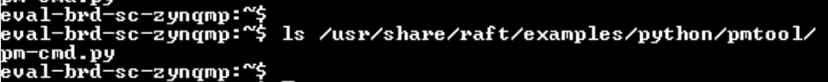
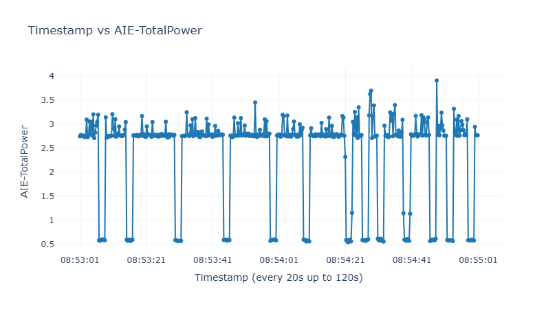

<table class="sphinxhide" width="100%">
 <tr width="100%">
    <td align="center"><h1>YOLOX-Nano INT8: Inference and Power Measurement on VEK385</h1>
    </td>
 </tr>
</table>

## Introduction

This tutorial demonstrates **YOLOX-Nano INT8 model inference and NPU power measurement** on the AMD Versal AI Edge Series Gen 2 VEK385 Evaluation Kit using Vitis AI 6.3.

The tutorial covers:

- **[Model Preparation](#model-preparation)**: Download the model from Xilinx Model Zoo and convert depthwise convolutions to regular convolutions for optimal NPU compilation.
- **[Accuracy Evaluation](#accuracy-evaluation)**: Measure mAP on COCO val2017 using pycocotools on both CPU and NPU.
- **[NPU Compilation](#npu-compilation)**: Compile the model for VEK385 using VitisAI Execution Provider.
- **[Power Profiling](#power-profiling)**: Measure NPU power consumption across active inference and idle states using RAFT utilities.

The model compiled for the NPU is `yolox_nano_onnx_pt_regular_conv.onnx`, a variant of the INT8 model in which selected depthwise Convs are rewritten as mathematically-equivalent regular (dense) Convs for more efficient NPU execution.

## System Requirements

This tutorial requires:

* **Vitis AI 6.3 Docker** for Versal AI Edge Series Gen 2:
    * Instructions for installation and startup are in the Vitis AI User Guide for Versal AI Edge Series Gen 2.
* **VEK385 evaluation kit**:
    * Setup instructions are available in the Vitis AI User Guide for Versal AI Edge Series Gen 2.
* **Internet access**:
    * Necessary for downloading the YOLOX-Nano model and COCO dataset.
* **AIE-ML_v2 license file**:
    * For license file, follow instructions in the Vitis AI User Guide for Versal AI Edge Series Gen 2.

## What You Will Accomplish

You will:

- Download the pre-quantized YOLOX-Nano INT8 model from AMD/Xilinx Model Zoo
- Convert depthwise convolutions to regular convolutions for optimal NPU performance
- Evaluate model accuracy (mAP) on COCO val2017 dataset
- Compile the model for VEK385 NPU using Vitis AI Execution Provider
- Run inference on the VEK385 NPU and measure accuracy
- **Profile NPU power consumption** using RAFT power measurement utilities
- Analyze power characteristics across active inference and idle states

## Tutorial Workflow

### Repo Layout

```
compile.py                           # Compile the model for VEK385 (VitisAI EP, target VAIML)
convert_depthwise_to_regular.py      # Rewrite selected depthwise Convs as regular (dense) Convs
evaluate.py                          # COCO mAP evaluation (CPU / NPU), dump / from-results split
preprocess.py                        # Image preprocessing (letterbox resize, BCHW)
postprocess.py                       # Decode + class-aware NMS
vitisai_config.json                  # VitisAI partition config (device ve2, optimize_level 4, tp_size 5)
vart_config.json                     # VART-ML configuration for NPU inference
Makefile                             # Build ml_vart_power application
ml_vart_power.cpp                    # VART-ML C++ application for power profiling
images/                              # Tutorial images (power plots, board photos)
onnx_model/
  yolox_nano_onnx_pt_regular_conv.onnx   # INT8 QDQ model, depthwise Convs -> regular Convs (used here)
pt_yolox-nano_3.5/                   # Downloaded from Xilinx Model Zoo (see Step 1)
  quantized/
    yolox_nano_onnx_pt.onnx              # INT8 QDQ model (source)
  float/                                 # FP32 reference model
  code/                                  # Training/evaluation scripts
  data/                                  # Sample data
```

---

# Model Preparation

This section covers downloading the pre-quantized INT8 model and converting it for optimal NPU execution.

## Step 1: Download the Model

The INT8 model comes from the Xilinx YOLOX-Nano package:

```bash
wget -O pt_yolox-nano_3.5.zip "https://www.xilinx.com/bin/public/openDownload?filename=pt_yolox-nano_3.5.zip"

unzip pt_yolox-nano_3.5.zip
```

This gives the source INT8 QDQ model at
`pt_yolox-nano_3.5/quantized/yolox_nano_onnx_pt.onnx`.

## Step 2: Convert Depthwise Convs to Regular (Dense) Convs

The model used in this repo, `onnx_model/yolox_nano_onnx_pt_regular_conv.onnx`, is
the INT8 model with selected depthwise Convs rewritten as regular (dense) Convs.
This is mathematically equivalent (bit-exact outputs) but compiles more
efficiently on the NPU.

Run the conversion inside the Vitis AI 6.3 release docker:

```bash
python3 convert_depthwise_to_regular.py --input pt_yolox-nano_3.5/quantized/yolox_nano_onnx_pt.onnx --output onnx_model/yolox_nano_onnx_pt_regular_conv.onnx
```

For each target Conv, `convert_depthwise_to_regular.py` traces back through the
QuantizeLinear / DequantizeLinear pair to the weight initializer, expands the
depthwise weight from `(C, 1, H, W)` to `(C, C, H, W)` with the original filters
on the channel diagonal and zeros elsewhere, and sets the `group` attribute to 1.
Five nodes are converted by default:


| Conv node | group |
| --------- | ----- |
| Conv_1223 | 32    |
| Conv_1284 | 64    |
| Conv_1749 | 64    |
| Conv_2161 | 64    |
| Conv_2201 | 64    |


Expected output:

```
Loading model from: pt_yolox-nano_3.5/quantized/yolox_nano_onnx_pt.onnx

Converting 5 depthwise Conv nodes to regular Conv...
Converted Conv_1223: group 32 -> 1, weight (32, 1, H, W) -> (32, 32, H, W)
Converted Conv_1284: group 64 -> 1, weight (64, 1, H, W) -> (64, 64, H, W)
...

Total converted: 5/5 depthwise Conv nodes

Saving converted model to: onnx_model/yolox_nano_onnx_pt_regular_conv.onnx

Done!
```

---

# Accuracy Evaluation

This section covers preparing the COCO dataset and evaluating model accuracy on both CPU and NPU.

## Step 3: Prepare COCO Dataset

```
# Create dataset directory
mkdir -p coco && cd coco

# Download COCO 2017 validation images (~1GB, 5000 images)
wget http://images.cocodataset.org/zips/val2017.zip
unzip val2017.zip

# Download COCO 2017 annotations (~241MB, required for accuracy evaluation)
wget http://images.cocodataset.org/annotations/annotations_trainval2017.zip
unzip annotations_trainval2017.zip

cd ..
```

Use `--coco-root <path>` if your dataset lives elsewhere.

## Step 4: Evaluate on CPU (Host)

```bash
python3 evaluate.py --model onnx_model/yolox_nano_onnx_pt_regular_conv.onnx --coco-root <path/to/coco/dataset>
```

Expected output:

```
 Average Precision  (AP) @[ IoU=0.50:0.95 | area=   all | maxDets=100 ] = 0.209
 Average Precision  (AP) @[ IoU=0.50      | area=   all | maxDets=100 ] = 0.367
 Average Precision  (AP) @[ IoU=0.75      | area=   all | maxDets=100 ] = 0.216
 Average Precision  (AP) @[ IoU=0.50:0.95 | area= small | maxDets=100 ] = 0.069
 Average Precision  (AP) @[ IoU=0.50:0.95 | area=medium | maxDets=100 ] = 0.219
 Average Precision  (AP) @[ IoU=0.50:0.95 | area= large | maxDets=100 ] = 0.336

mAP@[.5:.95] = 0.2090
mAP@.5       = 0.3673
```

---

# NPU Compilation

This section covers compiling the model for deployment on the VEK385 NPU.

## Step 5: Compile for VEK385

Run inside the v6.3 release docker:

```bash
python3 compile.py
```

This creates a VitisAI inference session that partitions and compiles the model
for the NPU (target `VAIML`, device `ve2`, `optimize_level = 4`, `tp_size = 5`).
The compilation artifacts are cached under `./` using
`cache_key = yolox_nano_onnx_pt_regular_conv`.

## Step 6: Run on the VEK385 Board (NPU)

First install tqdm on the board:

```bash
python3 -m pip install tqdm
```

Then run inference on the NPU and dump detections to JSON. pycocotools is not
available on the board (architecture-specific native extension), so we only
collect detections here and compute mAP later on the host.

```bash
python3 evaluate.py \
    --model onnx_model/yolox_nano_onnx_pt_regular_conv.onnx \
    --coco-root <path/to/coco/dataset> \
    --target NPU \
    --cache_key yolox_nano_onnx_pt_regular_conv \
    --dump-results dumped_yolox_nano_onnx_pt_regular_conv.json
```

This writes the collected detections to
`dumped_yolox_nano_onnx_pt_regular_conv.json`. Copy that file back to the host
and compute mAP as shown next.

## Step 7: Compute mAP on the x86 Host

Copy the dumped JSON back to the host and compute mAP with pycocotools. If the
COCO dataset is in a different location than the script default, pass
`--coco-root`.

```bash
python3 -m pip install pycocotools 
python3 evaluate.py --coco-root <path/to/coco/datset> --from-results dumped_yolox_nano_onnx_pt_regular_conv.json
```

Expected output:

```
Loading detections from: dumped_yolox_nano_onnx_pt_regular_conv.json
...
 Average Precision  (AP) @[ IoU=0.50:0.95 | area=   all | maxDets=100 ] = 0.209
 Average Precision  (AP) @[ IoU=0.50      | area=   all | maxDets=100 ] = 0.367
 Average Precision  (AP) @[ IoU=0.75      | area=   all | maxDets=100 ] = 0.216
 Average Precision  (AP) @[ IoU=0.50:0.95 | area= small | maxDets=100 ] = 0.071
 Average Precision  (AP) @[ IoU=0.50:0.95 | area=medium | maxDets=100 ] = 0.218
 Average Precision  (AP) @[ IoU=0.50:0.95 | area= large | maxDets=100 ] = 0.334
 Average Recall     (AR) @[ IoU=0.50:0.95 | area=   all | maxDets=  1 ] = 0.209
 Average Recall     (AR) @[ IoU=0.50:0.95 | area=   all | maxDets= 10 ] = 0.338
 Average Recall     (AR) @[ IoU=0.50:0.95 | area=   all | maxDets=100 ] = 0.366
 Average Recall     (AR) @[ IoU=0.50:0.95 | area= small | maxDets=100 ] = 0.136
 Average Recall     (AR) @[ IoU=0.50:0.95 | area=medium | maxDets=100 ] = 0.405
 Average Recall     (AR) @[ IoU=0.50:0.95 | area= large | maxDets=100 ] = 0.558

mAP@[.5:.95] = 0.2091
mAP@.5       = 0.3670
```

---

# Power Profiling

This section demonstrates **NPU power profiling** on the AMD VEK385 evaluation platform using RAFT power measurement utilities. The methodology enables precise measurement of NPU power consumption across active inference and idle operational states.

## Step 8: Power Measurement Methodology on VEK385 Board

The inference application executes continuous inference cycles with configurable sleep periods, enabling precise measurement of NPU power consumption across active and idle operational states.

**Key Features:**

- Configurable inference pattern in `ml_vart_power` application: 200 inferences before sleep @ 1250MHz → 2-second sleep @ 100MHz → 100 inferences after sleep @ 1250MHz
- Dynamic AIE clock frequency management: 1250MHz (active inference) ↔ 100MHz (idle/sleep)
- Per-inference latency measurement with millisecond precision
- Integrated power monitoring via System Controller RAFT utilities


## ML VART Application Code Modifications for Power Measurement

The `ml_vart_power.cpp` application has been enhanced with power profiling capabilities. The modifications are shown here starting from the main execution flow. 

### 1. Main Execution Loop with Time-Based Control

**Location:** Lines 2158-2227

The main function implements a time-based forever loop that orchestrates the inference pattern with integrated AIE clock management:

```cpp
// Time-based loop control
auto loop_start_time = std::chrono::steady_clock::now();
size_t loop_iteration = 0;
size_t total_x_inferences = 0;  // Inferences before sleep
size_t total_y_inferences = 0;  // Inferences after sleep
double total_inference_time = 0.0;

// Configurable inference pattern (lines 2134-2136)
const size_t x_inferences = 200;      // Inferences before sleep (~300ms at 1.5ms/inference)
const size_t y_inferences = 100;      // Inferences after sleep (~150ms at 1.5ms/inference)
const unsigned int sleep_seconds = 2; // Sleep duration between batches

std::cout << "Inference loop started (will stop after " << options.max_duration_seconds << " seconds)" << std::endl;
std::cout << "Pattern: " << x_inferences << " inferences before sleep -> sleep " 
          << sleep_seconds << "s -> " << y_inferences << " inferences after sleep -> repeat" << std::endl;

while (true) {
  // Check duration limit
  if (options.max_duration_seconds > 0) {
    auto current_time = std::chrono::steady_clock::now();
    auto elapsed_seconds = std::chrono::duration_cast<std::chrono::seconds>(
        current_time - loop_start_time).count();
    
    if (elapsed_seconds >= static_cast<long long>(options.max_duration_seconds)) {
      cout << "Reached maximum duration of forever loop" << std::endl;
      break;  // Print statistics and exit
    }
  }
  
  loop_iteration++;
  std::cout << (loop_iteration == 1 ? "1st" : std::to_string(loop_iteration) + "th") 
            << " loop iteration - running " << x_inferences << " inferences before sleep" << std::endl;
  
  // Phase 1: Run inferences before sleep (at 1250MHz)
  for (size_t r = 0; r < x_inferences; ++r) {
    runner->run_inference_and_save(benchmark, options, total_x_inferences, 
                                   total_frames, total_inference_time, r + 1);
    total_x_inferences++;
  }
  std::cout << "Completed " << x_inferences << " inferences before sleep" << std::endl;
  
  // Phase 2: Transition to low-power state (at 100MHz)
  std::cout << "Setting AIE clock to 100MHz..." << std::endl;
  std::system("xrt-smi advanced --aie-clock -d0 -s 100M");
  
  std::cout << "Sleep " << sleep_seconds << "s" << std::endl;
  std::this_thread::sleep_for(std::chrono::seconds(sleep_seconds));
  
  std::cout << "Setting AIE clock to 1250MHz..." << std::endl;
  std::system("xrt-smi advanced --aie-clock -d0 -s 1250M");
  
  // Phase 3: Run inferences after sleep (at 1250MHz)
  std::cout << "Running " << y_inferences << " inferences after sleep" << std::endl;
  runner->mark_inference_after_sleep();
  for (size_t r = 0; r < y_inferences; ++r) {
    runner->run_inference_and_save(benchmark, options, total_y_inferences, 
                                   total_frames, total_inference_time, r + 1);
    total_y_inferences++;
  }
  std::cout << "Completed " << y_inferences << " inferences after sleep" << std::endl;
  std::cout << "Loop iteration " << loop_iteration << " complete. Total inferences: " 
            << (total_x_inferences + total_y_inferences) << std::endl;
}

// Print final statistics
std::cout << "Total loop iterations: " << loop_iteration << std::endl;
std::cout << "Total inferences before sleep: " << total_x_inferences << std::endl;
std::cout << "Total inferences after sleep: " << total_y_inferences << std::endl;
std::cout << "Total inferences: " << (total_x_inferences + total_y_inferences) << std::endl;
std::cout << "Average inference time over " << (total_x_inferences + total_y_inferences) 
          << " runs: " << std::fixed << std::setprecision(2) 
          << (total_inference_time / (total_x_inferences + total_y_inferences)) << " ms" << std::endl;
```


### 2. Per-Inference Timing Measurement

**Location:** Lines 1504-1595

The `run_inference_and_save()` function wraps each inference call with high-precision timing:

```cpp
int run_inference_and_save(bool benchmark,
                           const app_opt& options,
                           size_t iteration,
                           size_t total_frames,
                           double& total_inference_time,
                           size_t batch_inference_num = 0) {
  static size_t global_inference_count = 0;
  bool& is_after_sleep = get_after_sleep_flag();
  
  global_inference_count++;
  
  // High-precision timing around run_inference() call
  auto start = std::chrono::high_resolution_clock::now();
  if (vart_app_status::FAILURE == run_inference()) {
    return 1;
  }
  auto end = std::chrono::high_resolution_clock::now();
  
  double duration_us = static_cast<double>(
      std::chrono::duration_cast<std::chrono::microseconds>(end - start).count());
  double duration_ms = duration_us / 1000.0;
  
  // Accumulate total time
  total_inference_time += duration_ms;
  
  // Print timing with special label for first inference after sleep
  if (batch_inference_num > 0) {
    if (is_after_sleep && batch_inference_num == 1) {
      std::cout << "Inference time #" << batch_inference_num << " (first after sleep): "
                << std::fixed << std::setprecision(2) << duration_ms << " ms" << std::endl;
      is_after_sleep = false;
    } else {
      std::cout << "Inference time #" << batch_inference_num << ": "
                << std::fixed << std::setprecision(2) << duration_ms << " ms" << std::endl;
    }
  }
  
  // Save output if not in benchmark mode
  if (!benchmark) {
    // ... save output logic ...
  }
  
  return 0;
}
```


### 3. Dynamic AIE Clock Management via xrt-smi

**Location:** Lines 2197-2214

Controls AIE clock frequency for power state transitions using `xrt-smi` system calls:

**Reduce to idle state (100MHz):**

```cpp
cout << "Setting AIE clock to 100MHz..." << std::endl;
APP_LOG(AppLogLevel::INFO, options.app_log, "Setting AIE clock to 100MHz before sleep");
int ret = std::system("xrt-smi advanced --aie-clock -d0 -s 100M");
if (ret != 0) {
  APP_LOG(AppLogLevel::WARNING, options.app_log, "xrt-smi command failed with exit code %d", ret);
}
```

**Sleep period:**

```cpp
cout << "Sleep " << sleep_seconds << "s" << std::endl;
APP_LOG(AppLogLevel::DEBUG, options.app_log, "Sleeping for %u seconds", sleep_seconds);
std::this_thread::sleep_for(std::chrono::seconds(sleep_seconds));
```

**Restore to active state (1250MHz):**

```cpp
cout << "Setting AIE clock to 1250MHz..." << std::endl;
APP_LOG(AppLogLevel::INFO, options.app_log, "Setting AIE clock to 1250MHz after sleep");
ret = std::system("xrt-smi advanced --aie-clock -d0 -s 1250M");
if (ret != 0) {
  APP_LOG(AppLogLevel::WARNING, options.app_log, "xrt-smi command failed with exit code %d", ret);
}
```


### 4. After-Sleep Inference Tracking

**Location:** Lines 1495-1510

Helper functions to mark and track the first inference after each sleep cycle:

```cpp
static bool& get_after_sleep_flag() {
  static bool is_after_sleep = false;
  return is_after_sleep;
}

static void mark_inference_after_sleep() {
  static bool& flag = get_after_sleep_flag();
  flag = true;
}
```

This flag is used to label the first inference after sleep with "(first after sleep)" in the timing output, helping correlate timing variations with power state transitions.

### 5. Command-Line Option: `--max-duration`

**Location:** Lines 222, 1948-1963

Added command-line option to control execution duration:

```cpp
// Command-line help text (line 222)
std::cout << "  --max-duration <seconds>\tStop after specified duration in seconds (0 = run forever, default: 0)" << std::endl;

// Application options structure (lines 1948-1963)
struct app_opt {
  // ... existing fields ...
  size_t max_duration_seconds;  // Duration control
};
```

**Usage:**

```bash
./ml_vart_power --app-config vart_config.json --max-duration 140
```


### 6. Configurable Inference Pattern

**Location:** Lines 2134-2136

Compile-time constants define the active/idle cycle pattern:

```cpp
const size_t x_inferences = 200;      // Inferences before sleep (~300ms at 1.5ms/inference)
const size_t y_inferences = 100;      // Inferences after sleep (~150ms at 1.5ms/inference)
const unsigned int sleep_seconds = 2; // Sleep duration between batches
```

To customize the pattern, modify these constants and rebuild the application.

---


## Building the ml_vart_power Application

The `ml_vart_power` application is a C++ reference implementation built on VART-ML APIs, designed to execute compiled models with configurable active and sleep states.

### Build Prerequisites

- Download Vitis AI SDK for Versal AI Edge Series Gen 2
- ARM Cortex-A72/A53 cross-compilation toolchain (included with SDK)
- VART-ML libraries and headers (provided by SDK)


### Build Instructions

1. **Configure the build environment:**
  ```bash
   source /path/to/sdk/environment-setup-cortexa72-cortexa53-amd-linux
  ```
2. **Compile the application:**
  ```bash
   make all
  ```
   This produces the `ml_vart_power` executable binary.
3. **Clean build artifacts (optional):**
  ```bash
   make clean
  ```

---


## Power Measurement Workflow

Power profiling requires two concurrent terminal sessions to independently control the inference workload and power data acquisition:

```
┌─────────────────────────────────────────────────────────┐
│                    VEK385 Board                         │
│                                                         │
│  ┌───────────────────┐      ┌──────────────────┐        │
│  │  Application      │      │  System          │        │
│  │  Processor        │      │  Controller      │        │
│  │                   │      │                  │        │
│  │  - ml_vart_power  │      │  - pm-cmd.py     │        │
│  │  - NPU inference  │      │  - Power monitor │        │
│  └───────────────────┘      └──────────────────┘        │
│           │                          │                  │
└───────────┼──────────────────────────┼──────────────────┘
            │                          │
      ┌─────▼─────┐              ┌─────▼─────┐
      │ Terminal 1│              │ Terminal 2│
      │ (App)     │              │ (SC)      │
      └───────────┘              └───────────┘
```


### Measurement Procedure

**Setup Prerequisites:**

- Complete VEK385 board setup per the [VEK385 Board Setup Guide](https://vitisai.docs.amd.com/projects/gen2/en/latest/docs/setup_and_installation/board_setup.html)
- Boot the System Controller to initialize the runtime environment
- Confirm RAFT power measurement utilities are accessible at `/usr/share/raft/`



> **Note:** For System Controller firmware updates, refer to the [VEK385 System Controller Update Guide](https://xilinx-wiki.atlassian.net/wiki/spaces/A/pages/2273738753/Evaluation+Board+-+System+Controller+SC#5.-Updating-Your-System-Controller)


#### Terminal 1: System Controller Connection

**Windows Configuration (PuTTY):**

```
Connection type: Serial
Serial line: COM8 (verify port assignment in Device Manager)
Speed: 115200
```

**Linux Configuration:**

```bash
screen /dev/ttyUSB3 115200
# Alternative using minicom
minicom -D /dev/ttyUSB3 -b 115200
```

**2. Verify RAFT Power Monitoring Utility**

```bash
ls /usr/share/raft/examples/python/pmtool/pm-cmd.py
```


#### Terminal 2: Application Processor (Inference Execution)

**Deploy Application Artifacts**

Before initiating inference, transfer the following artifacts to the target board:

- `ml_vart_power` executable binary (freshly compiled from build step)
- `vart_config.json` configuration file
- Compiled model cache directory
- Input data binaries

**Launch Inference Workload**

```bash
cd /path/to/yolox_nano_int8
./ml_vart_power --app-config vart_config.json --benchmark --max-duration 140
```


#### Terminal 1: Power Data Acquisition

**Initiate Power Monitoring (After Inference Startup)**

```bash
cd /usr/share/raft/examples/python/pmtool
python pm-cmd.py output-csv --path /tmp/ 120 12
```

**Power Monitoring Parameters:**

- **Duration:** 120 seconds (synchronized with inference profiling window)
- **Sampling Rate:** 12 Hz (83ms sampling interval, maximum supported rate)
- **Output Format:** CSV file written to `/tmp/` with timestamp (example: `pmtool_20260714_085301.csv`)

**Monitor Completion**

The dual processes execute for staggered durations to ensure complete power data capture:

- **Power monitoring duration:** 120 seconds — captures the 120s inference workload power profile
- **Inference runtime duration:** 140 seconds — extends beyond power monitoring window to guarantee all power samples correspond to active workload

**Retrieve Power Data**

```bash
# Transfer CSV data from System Controller to host workstation
# From host, run scp command
scp root@<sc_ip>:/tmp/pmtool_*.csv ./
```

---


## Measurement Results


### Sample Inference Console Output

Console Output looks like:

```
Inference loop started (will stop after 140 seconds)
Pattern: 200 inferences before sleep -> sleep 2s -> 100 inferences after sleep -> repeat
1st loop iteration - running 200 inferences before sleep
Inference time #1: 4.04 ms
Inference time #2: 1.67 ms
Inference time #3: 1.56 ms
...
Inference time #200: 1.54 ms
Completed 200 inferences before sleep
Setting AIE clock to 100MHz...
INFO: Clock frequency of AIE partition(1) before setting is: 1250.00 MHz
INFO: Setting clock freq of AIE partition(1) is successful
Running clock freq of AIE partition(1) is: 104.00 MHz
Sleep 2s
Setting AIE clock to 1250MHz...
INFO: Clock frequency of AIE partition(1) before setting is: 104.00 MHz
INFO: Setting clock freq of AIE partition(1) is successful
Running clock freq of AIE partition(1) is: 1250.00 MHz
Running 100 inferences after sleep
Inference time #1 (first after sleep): 1.71 ms
Inference time #2: 1.55 ms
...
Inference time #100: 1.58 ms
Completed 100 inferences after sleep
Loop iteration 16 complete. Total inferences: 4800
---
Reached maximum duration of forever loop
Total loop iterations: 16
Total inferences before sleep: 3200
Total inferences after sleep: 1600
Total inferences: 4800
Average inference time over 4800 runs: 1.56 ms
Run completed successfully.
```


### Sample Power CSV Output

CSV Output looks like:


| Timestamp           | AIE-VCC_AIE_1-Power | AIE-VCC_AIE_2-Power | AIE-VCC_AIE_3-Power | AIE-VCC_AIE_4-Power | **AIE-TotalPower** |
| ------------------- | ------------------- | ------------------- | ------------------- | ------------------- | ------------------ |
| 2026-07-14 08:53:01 | 0.648               | 0.701               | 0.669               | 0.722               | **2.740**          |
| 2026-07-14 08:53:02 | 0.652               | 0.706               | 0.676               | 0.737               | **2.771**          |
| ...                 | ...                 | ...                 | ...                 | ...                 | ...                |
| 2026-07-14 08:53:07 | 0.097               | 0.167               | 0.169               | 0.147               | **0.580**          |
| 2026-07-14 08:53:08 | 0.100               | 0.173               | 0.161               | 0.133               | **0.567**          |
| 2026-07-14 08:53:09 | 0.635               | 1.099               | 0.674               | 0.730               | **3.138**          |
| 2026-07-14 08:53:09 | 0.634               | 0.686               | 0.667               | 0.725               | **2.712**          |


---


## Analyzing the Output

The power profiling data visualizes the dynamic power characteristics of the NPU across active inference and idle states over the 120-second measurement window.



### Power Profile Analysis

The plot demonstrates clear power state transitions corresponding to the configured inference pattern (200 inferences @ 1250MHz → 2s sleep @ 100MHz → 100 inferences @ 1250MHz):

**Active Inference State (1250 MHz AIE Clock):**

- **Power Consumption:** ~2.7–3.0 W (AIE-TotalPower)
- **Duration:** Corresponds to the 200-inference and 100-inference phases
- **Characteristics:** Stable power plateau with minor variations reflecting inference workload execution
- **Peak Power:** Occasional spikes up to ~3.5–3.9 W observed during phase transitions or cache/memory access patterns

**Idle State (100 MHz AIE Clock):**

- **Power Consumption:** ~0.5–0.6 W (AIE-TotalPower)
- **Duration:** 2-second sleep periods
- **Power Reduction:** **~80–82% reduction** compared to active inference state
- **Characteristics:** Sharp power drops clearly visible as vertical transitions in the plot

**Key Observations:**

1. **Repeating Pattern:** The power profile exhibits a periodic sawtooth pattern with multiple complete cycles over 120 seconds, matching the expected loop iterations. Each cycle consists of active inference phases (~2.7-3.0W) separated by low-power sleep periods (~0.5-0.6W).
2. **Transition Speed:** Power transitions between 1250 MHz and 100 MHz states occur rapidly (within 1-2 sampling periods of 83ms), demonstrating efficient AIE clock management via `xrt-smi`.
3. **Power Efficiency:** The 100 MHz idle state achieves significant power savings while maintaining system responsiveness, validating the effectiveness of dynamic frequency scaling for NPU power management.
4. **Measurement Quality:** The clean separation between active and idle power levels (no intermediate states) confirms proper synchronization between the inference application and power monitoring, with no contamination from application startup or shutdown phases.

**Power Budget Implications:**

- **Average Power (Mixed Workload):** Combining active and idle phases yields an effective average power significantly lower than continuous inference at 1250 MHz
- **Thermal Design:** The idle phases provide thermal relief, enabling sustained high-performance operation without thermal throttling
- **Energy Efficiency:** For workloads with bursty inference patterns, dynamic clock management offers substantial energy savings compared to fixed-frequency operation

---


## Best Practices

1. **Power Monitoring Synchronization:** Always initiate power monitoring after starting the inference workload to ensure AIE initialization completes before data acquisition begins (prevents capturing transient startup states)
2. **Timing Configuration for Clean Power Data:** The inference application runs for **140 seconds** while power monitoring captures only **120 seconds** of active workload. This 20-second buffer ensures that power measurements stop before the inference application terminates, avoiding garbage power values that may occur during application shutdown and cleanup phases.
3. **Power State Management:** The sleep periods at **100MHz AIE clock** significantly lower power consumption compared to the active inference state at **1250MHz**. This dynamic clock frequency management enables precise characterization of NPU power across active (high-performance) and idle (low-power) operational states, demonstrating the power efficiency capabilities of the VEK385 platform.
4. **Controlled Termination:** Use `--max-duration` when running `ml_vart_power` for graceful shutdown and complete statistics collection; avoid `Ctrl+C` interruption which may leave the AIE clock in an undefined state
5. **Thermal Stabilization:** Allow the board to reach thermal equilibrium before starting measurements to minimize temperature-dependent power variation
6. **Sampling Rate Constraint:** Maximum supported System Controller sampling rate is 12 Hz (83ms period)

---

<p class="sphinxhide" align="center"><sub>Copyright © 2024–2026 Advanced Micro Devices, Inc.</sub></p>
<p class="sphinxhide" align="center"><sup><a href="https://www.amd.com/en/corporate/copyright">Terms and Conditions</a></sup></p>
