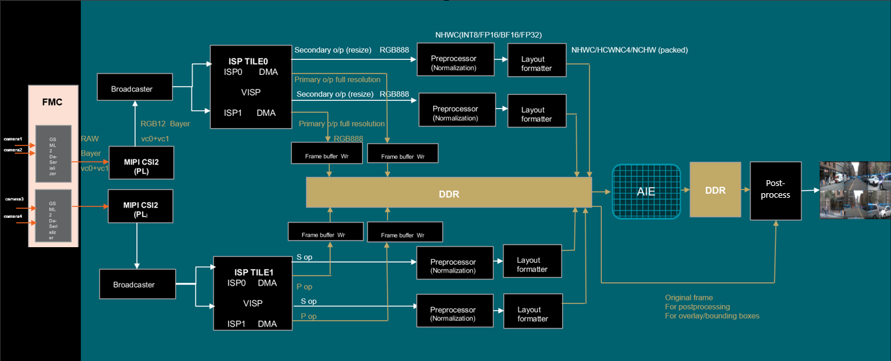
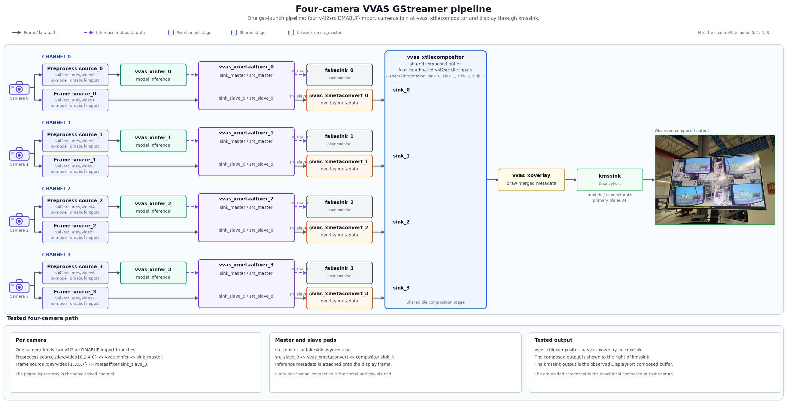

# Design Details — VEK385 MIPI Streaming AI Reference Design

This document describes the hardware and software architecture of the VEK385 MIPI Streaming AI Reference Design. The hardware architecture covers the four main pipelines: capture, preprocessing, inference, and display. The software architecture explains the driver stack, runtime APIs, and GStreamer plugins used to build the end-to-end application.

## Hardware Architecture

Following block diagram gives overview of this reference design.



*Figure 1: End-to-End Camera Stream Based Inference Design -- Block Diagram*

The hardware design is organized into four pipelines, each handling a distinct stage of the data flow from camera input to display output.

### Capture Pipeline

The capture pipeline acquires raw image data from the camera sensors, processes it through the ISP, and writes the output frames to DDR.

**Camera Sensors:** The design supports two sensor types, connected via FAKRA coax cables to the FMC-96716A GMSL2 daughter card. Two sensors per MIPI link using Virtual Channels **VC0** and **VC1**.

- **OX03F10** — OmniVision 3MP, 12-bit RAW HDR sensor. Native resolution 1920×1080.
- **Sony IMX728** — 8MP, 12-bit RAW sensor. Native resolution 3840×2160; ISP downscales to 1920×1080 for Main/Secondary Path outputs.

**FMC-96716A:** [Xylon LogiFMC-GMSL2-96716A-12C - 12-Ch GMSL2 FMC Board](https://xylon-lab.com/product-category/related-products/xylon-fmc/) 12-channel MIPI D-PHY GMSL2 FMC board. Provides GMSL2 deserialization and feeds **MIPI2 + MIPI3** CSI-2 links to the SoC.

**MIPI CSI-2 RX Subsystem (6.0):** Captures RAW12 image data from the sensors and outputs AXI4-Stream video data.

| Configuration | Value |
| --- | --- |
| Pixel Format | RAW12 |
| PHY Mode | DPHY |
| Lane Rate | 1500 Mbps (4 lanes) |
| Pixels Per Clock | 4 |
| Virtual Channels | VC0 + VC1 per link |
| Buffer Depth | 4096 |

**ISP — VISP 1.0 (Versal Hardened IP):** Operates in **LILO** (**Live In Live Out**, Non-MCM) mode — the ISP streams pixels straight through (input frames in, output frames out) without buffering full frames to memory between stages. Converts Bayer RAW12 to RGB888 at 1920×1080@25fps output. For IMX728, the sensor input (IBA) is 3840×2160 and the ISP downscales to 1920×1080 for both Main and Secondary Path outputs. Each ISP instance provides two streaming outputs:

| Configuration | Value |
| --- | --- |
| Tiles | Tile0 + Tile1 (2 ISP cores per tile) |
| Operating Mode | LILO (Non-MCM) |
| Core Clock | 600.1 MHz |
| Input Format | RAW12, 4 PPC |
| Input Resolution (IBA) | 1920×1080 (OX03F10) or 3840×2160 (IMX728) |
| Main Path output | RGB888, 1920×1080, 8-bit, 4 PPC |
| Secondary Path output | RGB888, 1920×1080, 8-bit, 4 PPC |
| RPU Assignment | RPU6 (Tile0), RPU7 (Tile1) |
| ISP Tuning (on target) | `/usr/share/Tuning_files/OX03F10/` (OX03F10) or `/usr/share/Tuning_files/IMX728/` (IMX728) |

> **RPU Assignment:** The Versal hardened ISP (VISP) is controlled by firmware running on the platform's Real-time Processing Unit (RPU / Cortex-R52) cores rather than by the APU. Each ISP tile is driven by a dedicated RPU core: **Tile0 is managed by RPU6** and **Tile1 by RPU7**. These cores run the ISP control firmware that programs the pipeline stages and applies the sensor tuning/calibration files.

- **Primary Output (Main Path):** 1920×1080 RGB frames written to DDR via Frame Buffer Write for tiled 4K display
- **Secondary Output:** 1920×1080 RGB frames forwarded to the streaming preprocessing pipeline for AI inference

**ISP Tuning:** This design uses the prebuilt per-sensor tuning/calibration files loaded from `/usr/share/Tuning_files/<SENSOR>/` at camera initialization; authoring or modifying sensor tuning via the ISP interfaces is outside the scope of this reference design. For ISP architecture and tuning details, refer to the [Versal AI Edge Series Gen 2 ISP Product Guide (PG432)](https://docs.amd.com/r/en-US/pg432-versal-ai-edge-series-gen-2-isp).

**Frame Buffer Write:** Xilinx catalog IP (`v_frmbuf_wr`) that converts AXI4-Stream to AXI4-MM and writes Primary Output frames to DDR through NoC. See the [Video Frame Buffer Read/Write LogiCORE IP Product Guide (PG278)](https://docs.amd.com/r/en-US/pg278-v-frmbuf).

### Preprocess Pipeline

The preprocessing pipeline takes the ISP Secondary Output and converts it into AI-ready tensors suitable for NPU inference. It consists of two streaming PL IPs connected back-to-back. For detailed documentation of these IPs, refer to [Streaming Preprocess and AI Layout Formatter PL IPs](streaming_preprocess_ips.md).

**Preprocess IP:** Performs resize, color space conversion, mean subtraction, and scale normalization on the incoming video stream. The alpha (mean) and beta (scale) parameters are programmed in Q23 fixed-point format via the `compute_preprocess_params.sh` script.

The `compute_preprocess_params.sh` script is delivered on the target root filesystem at `/etc/vvas/examples/camera/compute_preprocess_params.sh`. It takes the per-channel mean and scale values expected by the target model, converts them to the Q23 fixed-point `alpha`/`beta` integers (`value × 2^23`) required by the Preprocess IP, and writes them to the IP registers. It is invoked automatically by the `run_4cam_yoloxm_4kdp.sh` / `run_4cam_resnet50_4kdp.sh` launch scripts before the pipeline starts, so it does not normally need to be run by hand; run it manually only when experimenting with a different model or normalization scheme.

| Configuration | Value |
| --- | --- |
| Samples Per Clock | 4 |
| Interpolation | Nearest Neighbor |
| Input Resolution | 1920x1080 |
| Output Resolution | Configurable (e.g., 640x640 for YOLO) |
| URAM | Enabled (for 2 streams) |
| Channel Order (GBR) | Enabled |
| Data Type | INT8 |
| RGB to RGBA | Enabled |

**AI Layout Formatter:** Receives streaming data from the Preprocess IP and writes the processed data to DDR memory in the configured AI layout format.

| Configuration | Value |
| --- | --- |
| Samples Per Clock | 4 |
| Max Resolution | 1920x1080 |
| Address Width | 64-bit |
| Supported Layouts | NHWC, NCHW, HCWNC4 |
| Data Type | INT8 |
| RGBA | Enabled |

### Inference and Postprocess Pipeline

This pipeline handles AI model execution on the NPU and overlays the inference results onto the display frames.

**AI Engine Inference:** Preprocessed tensors stored in DDR are read by the AI Engine array via the AMD XDNA driver. ONNX Models are quantized and compiled with the **Vitis AI** flow for the target NPU; the compiled model is what executes on the AI Engine at runtime. This release was validated with **YOLOx-M** (object detection) and **ResNet-50** (scene classification); other Vitis AI–compiled ONNX models can be run through the same pipeline. Zero-copy DMA buffer support enables efficient data transfer between the PL preprocessing stage and the NPU.

> **Version note:** Models must be compiled with the **Vitis AI 6.3** released tools that match this design's runtime (aligned with the Vivado/Vitis 2026.1 flow and the runtime shipped in the root filesystem). Models compiled against a mismatched Vitis AI / runtime version may fail to load or produce incorrect results. For the ONNX quantization and compilation flow, see the [Vitis AI 6.3 User Guide for Versal AI Edge Series Gen2](https://vitisai.docs.amd.com/projects/advanced-micro-devices-63-gen2/en/latest/index.html) — in particular the [Model Compilation](https://vitisai.docs.amd.com/projects/advanced-micro-devices-63-gen2/en/latest/docs/model_compilation/compiling.html) section.

**Software Postprocessing:** Inference results (bounding boxes, class labels, confidence scores) are processed on the APU (Cortex-A78) and overlaid onto the corresponding Main Path video frames using VVAS GStreamer plugins (`vvas_xmetaconvert`, `vvas_xoverlay`).

### Display Pipeline

The display pipeline composites the processed video streams and outputs them to the monitor.

**Software Compositor:** The `vvas_xtilecompositor` GStreamer plugin composites the 4 camera streams (with inference overlays) into a single 4K (3840x2160) tiled frame arranged in a 2x2 grid.

**DisplayPort:** The composited output is rendered via the PS DisplayPort interface using the DRM/KMS Linux framework and the AMD DRM driver. HDMI output is not supported in this design.

## Software Architecture

The software stack spans from user-space applications down to kernel-space drivers, organized into three layers.

| Layer | Components |
| --- | --- |
| **Application (user-space)** | Application scripts, GStreamer multimedia framework for video pipeline control |
| **Plugins and Runtime frameworks (user-space)** | GStreamer plugins (v4l2src, vvas\_xinfer, vvas\_xoverlay, vvas\_xtilecompositor), media-ctl, VART-ML/VART-X runtimes |
| **OS / Drivers (kernel-space)** | V4L2/Media subsystems, ISP driver (VISP), DMA engine drivers, DRM/KMS display driver |

The software components are divided by domain:

- **Video Capture:** The v4l2src GStreamer plugin captures frames from V4L2 device nodes. The media controller library configures sub-devices and media graphs. Kernel-space includes the V4L2/Media subsystem, VISP ISP driver, and the framebuffer DMA driver.
- **Processing:** Inference is driven entirely by the `vvas_xinfer` GStreamer plugin. `vvas_xinfer` internally encapsulates the underlying inference runtimes (VART-ML for NPU-offloaded model execution with zero-copy support, and VART-X for hardware-accelerated video-analytics integration). For details of the plugin and the runtimes it wraps, see the [VVAS plugins documentation](https://vitisai.docs.amd.com/en/6.3/).
- **Display:** The `vvas_xtilecompositor` plugin tiles the output streams. Display is driven through the DRM/KMS subsystem and the AMD DRM driver via PS DisplayPort.

**V4L2 Device Node Mapping:**

`video1`, `video3`, `video5` and `video7` nodes are Main Path outputs for the four cameras. `video0`, `video2`, `video4` and `video6` are preprocessed outputs from the Secondary Path of the four cameras.

## GStreamer Pipeline Details

The following block diagram shows the tested four-camera GStreamer pipeline.



*Figure 2: Four-camera VVAS GStreamer pipeline*

The end-to-end inference pipeline is built using GStreamer. Figure 2 matches `run_4cam_yoloxm_4kdp.sh` and `run_4cam_resnet50_4kdp.sh` in `/etc/vvas/examples/camera/`.

**Full pipeline (4-camera YOLOx-M):** The complete `gst-launch-1.0` command below is what the launch script assembles (also printable via `./run_4cam_yoloxm_4kdp.sh --dry-run`). It is shown here in full for context; each element and its parameters are described in the list that follows. The pattern for `camN` (`v4l2src` → `vvas_xinfer` → `vvas_xmetaaffixer` → compositor sink) repeats for all four cameras; only camera 0 is shown expanded, with cameras 1–3 abbreviated.

```
gst-launch-1.0 -e \
  vvas_xtilecompositor name=comp probe-downstream-layout=true \
    xclbin-location=/run/media/mmcblk0p1/x_plus_ml.xclbin \
    ! video/x-raw,format=BGR,width=3840,height=2160,framerate=25/1 \
    ! vvas_xoverlay \
    ! kmssink driver-name=mmi-dc connector-id=46 plane-id=34 \
        force-modesetting=true restore-crtc=false show-preroll-frame=false sync=false \
  vvas_xmetaaffixer name=ma0 sync=false timeout=-1 \
  \
  # ---- Camera 0 ----
  v4l2src device=/dev/video0 io-mode=dmabuf-import \
    ! video/x-raw,format=RGBx,width=640,height=640,framerate=25/1 \
    ! vvas_xinfer name=infer0 config-file=.../yoloxm_int8_vart_extppe_column0.json \
    ! ma0.sink_master \
  v4l2src device=/dev/video1 io-mode=dmabuf-import \
    ! video/x-raw,format=BGR,width=1920,height=1080,framerate=25/1 \
    ! ma0.sink_slave_0 \
  ma0.src_master ! fakesink async=false \
  ma0.src_slave_0 ! vvas_xmetaconvert config-location=.../metaconvert.json ! comp.sink_0 \
  \
  # ---- Cameras 1-3: same pattern on /dev/video2..7 -> comp.sink_1..sink_3 ----
  ...
```

Key formats and parameters:

| Stream | Node | Caps | Notes |
| --- | --- | --- | --- |
| Secondary Path (tensor) | `/dev/video0,2,4,6` | `RGBx`, 640×640 (YOLOx-M) / 224×224 (ResNet-50), 25 fps | Preprocessed INT8 HCWNC4 tensor input to `vvas_xinfer` |
| Main Path (display) | `/dev/video1,3,5,7` | `BGR`, 1920×1080, 25 fps | Camera frames tiled by the compositor |
| Compositor output | — | `BGR`, 3840×2160, 25 fps | Single 2×2 tiled 4K display frame |

Expected throughput is **25 fps per camera** (4 × 1080p tiles composited into one 4K @ 25 fps DisplayPort output), matching the bitstream's negotiated format for this release.

Each plugin is described below.

- **`v4l2src`:** Captures camera frames (Main Path, 1920x1080 BGR) and tensors (Secondary Path). `io-mode=dmabuf-import` is required on the frame path so each camera uses the compositor's display buffers. Other io-modes are not supported for that shared-display path; they would give each stream its own buffers.
- **`vvas_xinfer`:** Runs AI inference on the captured tensors.
- **`vvas_xmetaaffixer`:** Attaches inference metadata from the tensor stream (`sink_master`) onto the matching camera frames (`sink_slave_0`). `src_master` is discarded; `src_slave_0` continues toward display.
    - `sync=false`: Do not wait to timestamp-match master and slave. Default is `true`, which stalls a live camera when inference is later than the frame.
    - `timeout=-1`: Disable the wait timeout so both pads are collected without giving up.
- **`fakesink`:** Discards the tensor stream after metadata is attached. `async=false` so it does not hold the pipeline in PAUSED.
- **`vvas_xmetaconvert`:** Converts inference metadata into overlay-ready boxes and labels. `config-location` is the metaconvert JSON.
- **`vvas_xtilecompositor`:** Tiles the four camera streams into one 4K display frame. It does not copy four separate stream buffers into a display buffer. The four streams share the same display buffers.
    - `probe-downstream-layout=true`: Take stride and size from `kmssink` so the display buffers match DisplayPort.
    - `xclbin-location`: Required for the XRT device/DMA-buffer allocator context (used for zero-copy `dma-buf` sharing), even though compositing runs in software. Do not omit it.
    - Output caps `video/x-raw,format=BGR,width=3840,height=2160,framerate=25/1` set the single display frame. `sink_0`…`sink_3` are the four 1920x1080 tiles.
- **`vvas_xoverlay`:** Draws detection boxes and labels on the composed display frame.
- **`kmssink`:** Displays the composed 4K frame on DisplayPort.
    - `driver-name=mmi-dc`
    - `connector-id=46` and `plane-id=34`: DRM IDs are **not guaranteed stable** across boards/kernels/displays. Override via `DP_CONNECTOR_ID` / `DP_PLANE_ID`, and discover valid IDs on target with `modetest -M mmi-dc -c` (connectors) and `modetest -M mmi-dc -p` (planes).
    - `force-modesetting=true`: Set the 4K CRTC mode.
    - `restore-crtc=false`: Do not restore the previous mode on stop.
    - `show-preroll-frame=false`
    - `sync=false`: Do not clock-sync this live pipeline (this is `kmssink` sync, not metaaffixer sync).
