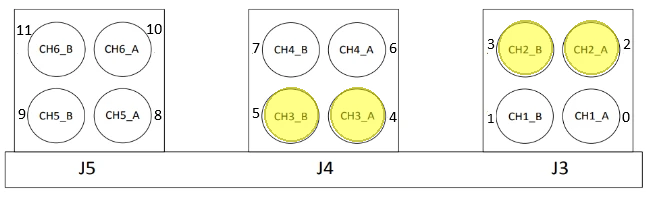
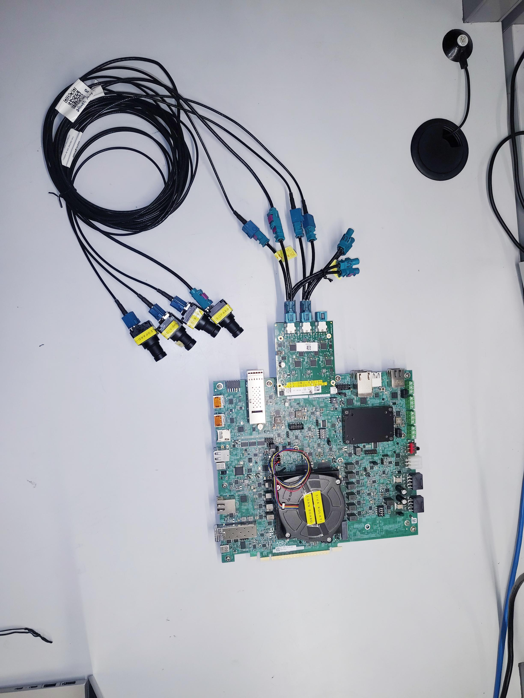
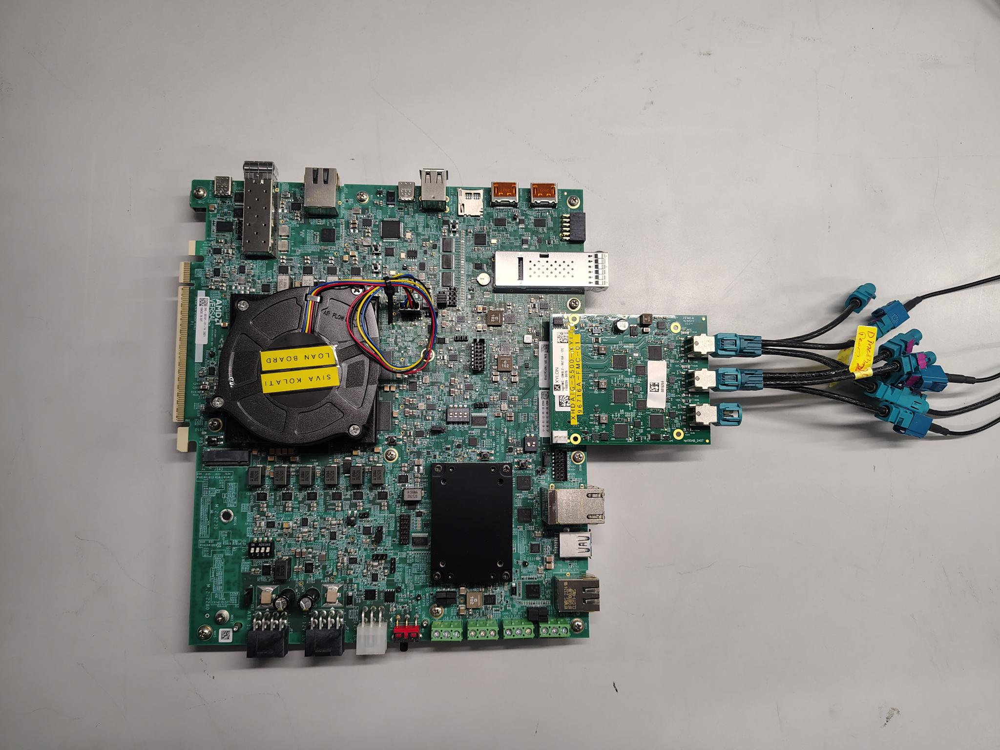
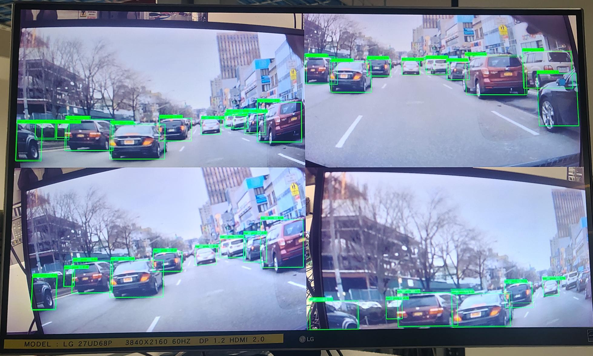
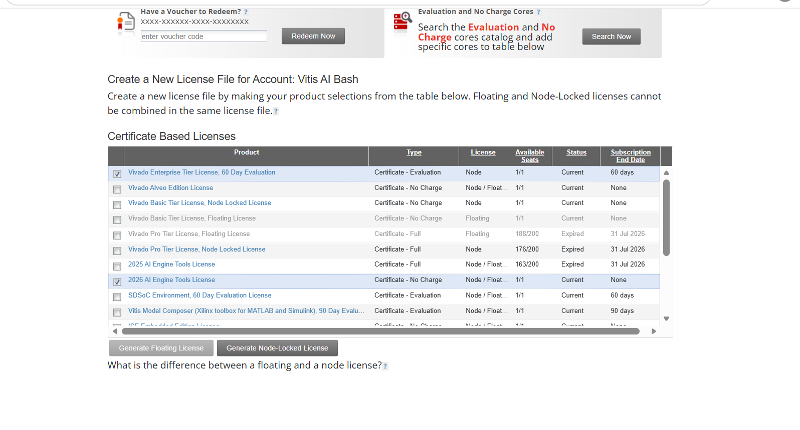

# VEK385 MIPI Streaming AI Reference Design

## 1. Introduction

### 1a. Overview

This Reference Design provides a complete end-to-end implementation on the Versal AI Edge Series Gen2 platform for multi-camera video capture, AI inferencing, and display on a 4K monitor. The design captures four live MIPI camera streams at 1080p @ 25 fps per camera through the Versal hardened ISP, performs hardware-accelerated streaming preprocessing in the PL, runs AI inference on the AI Engine (AIE), and displays composited results with inference overlays on a 4K DisplayPort monitor.

This reference design targets the **VEK385 Rev-B** evaluation board with **4 camera sensors** connected via the **FMC-96716A** daughter card. The following sensors are supported:

- **OX03F10** — OmniVision 3MP, 12-bit RAW HDR sensor
- **Sony IMX728** — 8MP, 12-bit RAW sensor

For the architecture and design details, refer to [Design Details](Design_details_streaming_ref_design.md).

### 1b. Features, Specifications, and Limitations

**Supported Features:**

- **4-camera streaming:** 4× live MIPI capture via FMC-96716A (2 MIPI links × 2 virtual channels), with dual ISP tile / 4-core streaming in **LILO** mode
- **Streaming preprocessing:** Hardware-accelerated PL-based [Preprocess and AI Layout Formatter IPs](streaming_preprocess_ips.md) perform resize, color space conversion, normalization, and tensor layout formatting on the ISP Secondary Path output
- **AI inferencing:** AI Engine inferencing on Secondary Path tensors via NPU. Validated with YOLOx-M (object detection) and ResNet-50 (classification); other Vitis AI–compiled ONNX models can be run using the same pipeline (see the model-compilation note under [Step 3 — Run inference pipelines](#2d-initialize-camera-and-run-applications))
- **Live display:** 4K DisplayPort output with inference overlays across all 4 tiled Main Path streams
- **AI data formats:** INT8 with HCWNC4 / NHWC / NCHW layouts
- **Application pipelines:** GStreamer-based pipelines for object detection and scene classification

**Hardware Specifications:**

| Parameter | Value |
| --- | --- |
| Target Board | VEK385 Rev-B |
| FMC Card | Xylon FMC-96716A |
| Camera Sensors | 4x OX03F10 (3MP, 12-bit RAW HDR) **or** 4x Sony IMX728 (8MP, 12-bit RAW) |
| Sensor Input (IBA) | 1920×1080 (OX03F10) **or** 3840×2160 (IMX728) |
| Main Path (display tile) | 1920×1080 @ 25fps per camera |
| Secondary Path (AI) | **640×640** (YOLO), **224x224** (Resnet50) after preprocess |
| ISP Mode | LILO (Live-In Live-Out), Non-MCM |
| MIPI Configuration | 4 lanes, 1500 Mbps, RAW12, 4 PPC |
| Display Output | 4K (3840×2160) via PS DisplayPort |
| Tool Version | Vivado/Vitis 2026.1 |

## 2. Quick Start Guide

### 2a. Hardware Prerequisites

| Component | Requirement |
| --- | --- |
| Board | VEK385 **Rev-B** |
| FMC Card | FMC-96716A ([Xylon LogiFMC-GMSL2-96716A-12C - 12-Ch GMSL2 FMC Board](https://xylon-lab.com/product-category/related-products/xylon-fmc/)) |
| Camera Sensors | 4x OX03F10 (12-bit RAW HDR) **or** 4x Sony IMX728 (12-bit RAW) connected via FAKRA coax cables on FMC ports **2, 3, 4, and 5** |
| Display | 4K PS DisplayPort monitor + cable (HDMI not supported) |
| SD Card | SD/microSD card, **16 GB minimum** (**32 GB or larger recommended** — the flashed root filesystem uses ~11 GB, and extra space is needed for models/data). Class 10 / UHS-I or faster recommended. Flashing `rootfs.wic.xz` creates three partitions: a 1 GB **FAT32** boot partition (kernel/bootloader), a 1 GB **EXT4** storage partition (`/root/storage`, for models/user data), and an **EXT4** root filesystem partition that expands to fill the card on first boot. |
| Power | 12V, 15A, 180W power supply |
| Connectivity | Ethernet, USB-UART serial console cable |
| Tools | Vivado/Vitis 2026.1 |

### 2b. Board Setup

1. Connect the 4 camera sensors to **port numbers 2, 3, 4, and 5** on the FMC-96716A card, as shown below:

   

2. Connect the FMC card (with cameras attached) to the VEK385 Rev-B FMC slot

   

   

3. Connect the PS DisplayPort monitor
4. Connect the USB Type-C UART cable and Ethernet cable
5. Connect the 12V power supply

### 2c. Boot the Board

The flashing of OSPI and SD is done using scripts available at: `versal_2ve/tools/ospi_sd_flash/linux`

> **Note:** The steps below are to be run on **Linux** host machine to which VEK385 rev-B board is connected to.

**Switch Settings:**

| Boot Mode | SW1 Setting |
| --- | --- |
| JTAG (for OSPI flashing) | `0000` (all ON) |
| OSPI + SD (normal boot) | `0001` (SW1[1:3] = ON, SW1[4] = OFF) |

> **Note:** In the mode-pin code, a `0` bit corresponds to the switch **ON** and a `1` bit to the switch **OFF**.

**Step 1 -- Flash OSPI (via JTAG, one-time per board):**

**Prerequisite**: The flash script is an Expect script, so install expect on the host first: `sudo apt-get install expect`

Set SW1 to JTAG boot mode (`0000`), connect the board over USB, install Vivado Lab Edition 2026.1 on host, then run the flash script from the `versal_2ve/tools/ospi_sd_flash/linux` directory:

```
cd versal_2ve/tools/ospi_sd_flash/linux
./ve2-flash-ospi.exp --vivado-dir <path-to-vivado-lab-2026.1> --boot-images <PREBUILT_BOOT_IMAGES_PATH>
```

`PREBUILT_BOOT_IMAGES_PATH` refers to the extracted prebuilt boot images directory from the release package

After flashing completes, power off the board and set SW1 to OSPI boot mode (`0001`).

**Step 2 -- Flash SD card:**

**Prerequisite:** This step flashes the image with `bmaptool`, so install it on the host first: `sudo apt install bmap-tools`

Insert the SD card into the **host machine's** card reader (built-in `mmcblk` slot or a USB card reader). From the same `versal_2ve/tools/ospi_sd_flash/linux` directory, run:

```
sudo ./vek385-flash-sdcard.sh --boot-images /path/to/boot_images
```

The script auto-detects the SD card and asks you to confirm before writing (override with `--sd-device /dev/sdX`, which you can find via `lsblk`). It flashes `rootfs.wic.xz` (via `bmaptool`), copies the overlay files, installs the `vek385-setup.service` systemd unit, then ejects the card — remove it and insert it into the board in Step 3.

> **Warning:** All data on the selected device is erased. Make sure the correct card is selected before confirming.

**Step 3 -- Boot and verify automatic setup:**

Insert the SD card, confirm SW1 = OSPI (`0001`), power on, and log in as `amd-edf`.

The `vek385-setup.service` automatically programs the PL/AIE overlay and runtime environment -- no manual FPGA overlay loading step is required.

Verify automatic setup:

```
systemctl status vek385-setup.service
```

Expected output:

```
vek385-setup.service - VEK385 board setup (overlay, runtime, UFS)
     Loaded: loaded (/usr/lib/systemd/system/vek385-setup.service; enabled; preset: enabled)
     Active: active (exited) since Tue 2026-09-01 14:06:56 UTC; 3min 50s ago
    Process: 536 ExecStart=/overlay/setup_overlay.sh (code=exited, status=0/SUCCESS)
    Process: 727 ExecStart=/overlay/runtime_env.sh (code=exited, status=0/SUCCESS)
    Process: 729 ExecStart=/etc/ufs-config/configure_ufs.sh (code=exited, status=0/SUCCESS)
   Main PID: 729 (code=exited, status=0/SUCCESS)
        CPU: 662ms

lines 1-8/8 (END)
```

### 2d. Initialize Camera and Run Applications

All scripts are located at `/etc/vvas/examples/camera/` on the target board's root filesystem.

> **Note:** Camera pipeline setup configures the selected sensor type via the `--sensor` flag. Use `--sensor=ox03f10` for OX03F10 sensors or `--sensor=imx728` for Sony IMX728 sensors. The script configures FMC-96716A pinout (`fmc_id=1`), virtual channels, and ISP calibration/tuning files. Pipeline format negotiation must match the bitstream (1920×1080 @ 25fps for this release). ISP tuning files are loaded from `/usr/share/Tuning_files/OX03F10/` for OX03F10 and `/usr/share/Tuning_files/IMX728/` for IMX728 on the target.

**Scripts Details:**

| Script | Purpose |
| --- | --- |
| `camera_init_4cam.sh --sensor=<sensor> [--cameras=N]` | Initializes and negotiates the ISP/media pipeline. Use `--sensor=ox03f10` or `--sensor=imx728`. Optional `--cameras=1-4` selects how many ISP paths to program (default: 4). |
| `compute_preprocess_params.sh` | Computes ISP preprocessing parameters (alpha/beta in Q23 format) |
| `run_4cam_yoloxm_4kdp.sh [--cameras=N] [--display-fps] [--dry-run]` | Runs N-camera YOLOx-M inference + tiled 4K DP pipeline. `--display-fps` logs per-camera FPS to the console. `--dry-run` prints the `gst-launch-1.0` command without executing it. |
| `run_4cam_resnet50_4kdp.sh [--cameras=N] [--display-fps] [--dry-run]` | Runs N-camera ResNet-50 inference + tiled 4K DP pipeline. `--display-fps` logs per-camera FPS to the console. `--dry-run` prints the `gst-launch-1.0` command without executing it. |

All the steps below needs root access to run. So enter root user mode using below command.

```bash
sudo -i
```

**Step 1 — Initialize the 4-camera pipeline:**

```bash
cd /etc/vvas/examples/camera/
./camera_init_4cam.sh --sensor=ox03f10   # For OX03F10 sensors
# OR
./camera_init_4cam.sh --sensor=imx728    # For Sony IMX728 sensors
```

This script sets the FMC pinout, configures each of the 4 ISP sub-devices (sensor ID, virtual-channel ID, calibration/tuning files), starts `isp_media_server`, and negotiates media-ctl formats for all four streams.

The `--cameras` option selects how many ISP paths to initialize (1–4). When fewer than 4 cameras are connected, use this option to avoid timeouts on unconfigured ISPs:

```bash
# Initialize only the first 2 cameras (ports 2 and 3 on the FMC-96716A card):
./camera_init_4cam.sh --sensor=imx728 --cameras=2
```

When `--cameras` is not specified, the default is 4 (all cameras).

**Step 2 (Optional) — Verify the media pipelines:**

```bash
media-ctl -p -d /dev/media0
media-ctl -p -d /dev/media1
media-ctl -p -d /dev/media2
media-ctl -p -d /dev/media3
v4l2-ctl -d /dev/video0 --list-formats-ext
v4l2-ctl -d /dev/video1 --list-formats-ext
```

Confirm ISP output pads show **1920×1080**. For IMX728 sensors, ISP input pad (`:0`) shows **3840×2160** and output pads (`:1`, `:2`) show **1920×1080**.

**Step 3 — Run inference pipelines:**

> **Compiling your own models:** This release ships with prebuilt, Vitis AI 6.3–compiled YOLOx-M and ResNet-50 models. To run a different model, first quantize and compile your ONNX model with the **Vitis AI 6.3** tools, then point the corresponding `vvas_xinfer` config JSON at the compiled model. For the full quantization and compilation flow, see the [Vitis AI 6.3 User Guide for Versal AI Edge Series Gen2](https://vitisai.docs.amd.com/projects/advanced-micro-devices-63-gen2/en/latest/index.html), in particular the [Model Compilation](https://vitisai.docs.amd.com/projects/advanced-micro-devices-63-gen2/en/latest/docs/model_compilation/compiling.html) section (and [Model Quantization](https://vitisai.docs.amd.com/projects/advanced-micro-devices-63-gen2/en/latest/docs/model_quantization/model_quantization.html) for INT8/FP16).

*YOLOx-M object detection:*

```bash
./run_4cam_yoloxm_4kdp.sh
# Press Ctrl+C twice to exit - This is Known Issue in this release
```

When fewer cameras are connected, pass `--cameras` to match the initialization step. Unused compositor pads are automatically filled with black tiles so the 2×2 4K layout stays intact:

```bash
./run_4cam_yoloxm_4kdp.sh --cameras=2
```

*Dry-run mode — preview the GStreamer pipeline without executing it:*

The `--dry-run` option prints the full `gst-launch-1.0` command line and exits without running the pipeline. This is useful for debugging, inspecting element properties, or customizing the command before execution:

```bash
./run_4cam_yoloxm_4kdp.sh --dry-run
```

Example output:

```
[camera-yoloxm] Dry-run 4 live camera(s), 0 black tile(s):
gst-launch-1.0 -e vvas_xtilecompositor name=comp probe-downstream-layout=true
  xclbin-location=/run/media/mmcblk0p1/x_plus_ml.xclbin
  ! video/x-raw,format=BGR,width=3840,height=2160,framerate=25/1
  ! vvas_xoverlay ! kmssink driver-name=mmi-dc connector-id=46 plane-id=34
  force-modesetting=true restore-crtc=false show-preroll-frame=false sync=false
  vvas_xmetaaffixer name=ma0 sync=false timeout=-1 ...
  v4l2src device=/dev/video0 io-mode=dmabuf-import
  ! video/x-raw,format=RGBx,width=640,height=640,framerate=25/1
  ! vvas_xinfer name=infer0 config-file=...yoloxm_int8_vart_extppe_column0.json
  ...
```

You can copy the printed command, modify element properties (e.g. change `framerate`, `connector-id`, or add `num-buffers` for testing), and run it directly. The `--cameras` and `--dry-run` options can also be combined:

```bash
./run_4cam_yoloxm_4kdp.sh --cameras=2 --dry-run
```

*Display per-camera FPS — `--display-fps`:*

The `--display-fps` option logs the live per-camera frame rate to the console while the pipeline runs. It inserts a GStreamer `perf` element (named `CAM0`…`CAM3`) into each camera branch, so it requires the `perf` GStreamer plugin to be available. Equivalent to setting `DISPLAY_FPS=1` in the environment (the flag overrides the environment variable). It can be combined with the other options:

```bash
./run_4cam_yoloxm_4kdp.sh --display-fps                       # Log FPS for all 4 cameras
./run_4cam_yoloxm_4kdp.sh --cameras=2 --display-fps           # 2 cameras, with FPS logging
./run_4cam_yoloxm_4kdp.sh --display-fps --dry-run             # Preview the pipeline (shows the perf elements)
```

*Optional steps — Raw frame capture with yavta:*

`yavta` (Yet Another V4L2 Test Application) is a command-line V4L2 capture utility used here for **debug and verification**, independent of the GStreamer pipeline. It captures raw frames directly from a video node to a file so you can confirm that a given stage is producing correct data — for example, verifying that the ISP Main Path output is a valid RGB image, or that the Secondary Path preprocessed tensor has the expected resolution, layout, and byte layout before it reaches the NPU. The captured `.bin` files can be inspected offline (e.g. compared against a golden reference or viewed as raw images) to isolate whether an issue originates in the capture/ISP stage, the preprocessing stage, or the inference stage.

After running `run_4cam_yoloxm_4kdp.sh` (which sets the preprocessing parameters for YOLO resolution) run the commands below. The `--capture` flag sets the number of frames to capture, `-s` the frame size, `-f` the pixel format, `-F` the V4L2 device node to capture from, `--file=` the output file to write, and `-n` the number of V4L2 buffers to queue:

```bash
# ISP output (Main Path) - raw 1920x1080 RGB24:
yavta --capture=100 -s 1920x1080 -f RGB24 -F /dev/video1 --file=cam0_ISP_1920_1080_RGB.bin -n 10

# Preprocessed output (Secondary Path) - 640x640 HCWNC4 tensor:
yavta --capture=100 -s 640x640 -f HCWNC4_8_4_4 -F /dev/video0 --file=cam0_preproc_640_640_HCWNC4.bin -n 10
```

*ResNet-50 scene classification:*

```bash
./run_4cam_resnet50_4kdp.sh
# Press Ctrl+C twice to exit - This is Known Issue in this release
```

The `--cameras`, `--display-fps`, and `--dry-run` options work identically for the ResNet-50 script:

```bash
./run_4cam_resnet50_4kdp.sh --cameras=2            # Run with 2 cameras
./run_4cam_resnet50_4kdp.sh --display-fps           # Log per-camera FPS to the console
./run_4cam_resnet50_4kdp.sh --dry-run               # Preview pipeline
./run_4cam_resnet50_4kdp.sh --cameras=2 --dry-run   # Combined
```

**Troubleshooting:**

- If the pipeline fails with `ERROR: failed to load GStreamer plugin: vvas_xinfer`, clear the GStreamer plugin registry cache and retry:

```bash
rm -f ~/.cache/gstreamer-1.0/registry.*.bin
```

- Run `xrt-smi examine` to list detected devices and check the active NPU context during inference

```bash
xrt-smi examine
```

### 2e. Expected Results

- `media-ctl -p -d /dev/mediaN` (all 4) negotiates successfully without format-mismatch errors
- Live DisplayPort video shows all 4 camera streams tiled into 4K, with inference overlays rendered on each stream
- Output for Yolox-M int8 model detection for four cameras rendered on 4K monitor:



## 3. How to Build the Boot Images from Sources

The design sources are located under `versal_2ve/reference_design/vek385/rev-b/`. The directory structure is shown below, followed by the steps to configure and build all images from source.

**Source Directory Structure:**

```
versal_2ve/reference_design/vek385/
├── rev-b/
│   ├── build.cfg                  # Build configuration switches
│   ├── create_all_images.sh       # Single-step full build script
│   ├── create_pfm_hw.sh           # Build hardware platform
│   ├── create_pfm_sw.sh           # Build software (Yocto)
│   ├── create_vitis_app.sh        # Build Vitis AI Engine application
│   ├── hw/                        # Hardware design (Vivado TCL scripts, constraints)
│   ├── sw/yocto/                  # Yocto Linux build recipes
│   └── vitis_prj/                 # Vitis linker and overlay generation
├── rev-a/
└── README.md
```

Follow the steps below to build the images.

**Step 1 -- Update build.cfg:**

Edit `versal_2ve/reference_design/vek385/rev-b/build.cfg` to enable the MIPI configuration if not set already:

```
MIPI=1
```

**Step 2 -- Set up tools and patches:**

Install Vivado/Vitis 2026.1 tools.

Acquire the license for Vivado/Vitis tools by following instructions on following page:

```
https://vitisai.docs.amd.com/projects/advanced-micro-devices-63-gen2/en/latest/docs/additional_information/license.html
```

During license generation for Vivado/Vitis 2026.1 select following options:



Set `XILINXD_LICENSE_FILE` variable to point to the installed license:

```bash
export XILINXD_LICENSE_FILE=<path to xilinx.lic license file>
```

Source the Vivado/Vitis tools and apply the required Vivado patches:

```bash
source <VITIS_INSTALL_PATH>/2026.1/Vitis/settings64.sh
```

Ensure the following two Vivado tool patches are applied:

- [AR000040517](https://adaptivesupport.amd.com/s/article/000040517?language=en_US)
- [AR000040616](https://adaptivesupport.amd.com/s/article/000040616?language=en_US)

Set the `XILINX_PATH` environment variable to point to the patch directories:

```bash
export XILINX_PATH=<AR000040517_PATCH_PATH>/vivado:<AR000040616_PATCH_PATH>/vivado
```

Install linux packages needed on the host machine to build design images

```bash
sudo apt update
sudo apt install -y curl chrpath diffstat gawk lz4

export LC_ALL=en_US.UTF-8
export LANG=en_US.UTF-8
```

**Step 3 -- Build the images:**

To build the hardware platform, software, and Vitis application run the following scripts from `versal_2ve/reference_design/vek385/rev-b/`

> **Note:** These scripts generate all output in the `versal_2ve/reference_design/vek385/rev-b/artifacts` folder. The build requires a minimum of **100 GB free disk space** and a **Ubuntu 22.04 LTS** host with Vivado/Vitis 2026.1 installed.

**Step 3a -- Build the hardware platform:**

```bash
source create_pfm_hw.sh
```

This generates the hardware artifacts in the `hw/` folder:

- The extensible Vitis platform (XSA) for Vitis application integration
- The fixed XSA for software artifact generation

**Step 3b -- Build the software components (Yocto):**

```bash
source create_pfm_sw.sh
```

This generates the following output files in the `artifacts/` folder:

- System Device Tree (SDT)
- BOOT.bin
- Linux kernel image
- Root filesystem

**Step 3b.1 -- Prepare the UFS Boot Image:**

After the Yocto build completes, perform the following additional steps on the host system to prepare the UFS boot image for Rev-B:

1. Refer to [Vitis AI SDK](#3a-vitis-ai-sdk-optional----only-needed-to-build-your-own-applications) to install the sysroot and set up the environment.
2. Run the following script to create the UFS boot image:

```bash
source ./create_ufs_image.sh
```

**Step 3c -- Build the Vitis AI Engine application:**

```bash
source create_vitis_app.sh
```

This generates PL and AI Engine PDI and overlay dtbo files in the `artifacts/` folder:

- x\_plus\_ml.pdi
- x\_plus\_ml.dtbo

### 3a. Vitis AI SDK (optional -- only needed to build your own applications)

> **Note:** The reference design itself does **not** require any application compilation. The end-to-end pipelines are driven by the shell scripts under `/etc/vvas/examples/camera/` (see [Section 2d](#2d-initialize-camera-and-run-applications)), which invoke **prebuilt** GStreamer/VVAS plugins that are already included in the root filesystem. The AI Engine and PL overlay (`x_plus_ml.pdi`, `x_plus_ml.dtbo`) are produced by the boot-image build (Step 3c, `create_vitis_app.sh`), not by this SDK.
>
> The steps below are needed **only if you want to develop and cross-compile your own C/C++ applications** (for example, a custom VART-ML/VART-X application or a custom GStreamer element) against the target sysroot. If you only intend to run the reference design as delivered, you can skip this section.

The Vitis AI SDK / sysroot provides the cross-compilation environment and libraries (VART-ML/VART-X, VVAS, GStreamer, OpenCV, etc.) required to build such applications for the target device.

Complete the following steps on the host machine before you cross-compile applications for the target:

1. Copy the SDK installer from release package to a temporary location:

   ```
   cp <release_package>/sysroot/sdk.sh /tmp/sdk.sh
   ```

2. Make the installer executable:

   ```
   chmod +x /tmp/sdk.sh
   ```

3. Clear the library path to avoid conflicts:

   ```
   unset LD_LIBRARY_PATH
   ```

4. Install the SDK to the specified path:

   ```
   /tmp/sdk.sh -y -d <SYSROOT_PATH>
   ```

5. Source the sysroot environment for cross-compilation:

   ```
   source <SYSROOT_PATH>/environment-setup-cortexa72-cortexa53-amd-linux
   ```

**Additional System Device Tree details - Informative only, no action required:**

**System Device Tree Changes for MIPI:**

The MIPI-specific system device tree changes are defined in `versal_2ve/reference_design/vek385/rev-b/sw/yocto/meta-vek385/recipes-bsp/device-tree/files/custom_isp.dtsi`. This file reserves CMA memory regions for the 4 video capture (VCAP) nodes.

**PL DTSI Update for MIPI:**

The PL device tree overlay is automatically updated for MIPI using the `versal_2ve/reference_design/vek385/rev-b/vitis_prj/update_mipi_dtsi.py` script. This script updates compatible strings, adds port/endpoint nodes, configures DMA channels, and sets memory regions for the preprocess and AI Layout Formatter IPs.

## Design Details

For detailed hardware architecture, software architecture, and GStreamer pipeline details, refer to [Design Details — VEK385 MIPI Streaming AI Reference Design](Design_details_streaming_ref_design.md).

## Known Issues

1. **Ctrl+C must be pressed twice to exit the GStreamer pipeline:** Stopping the GStreamer pipeline requires pressing Ctrl+C twice. During teardown, the pipeline also reports the error "failed to acquire buffer from downstream pool."
