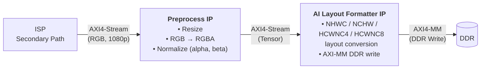

# Streaming Preprocess and AI Layout Formatter PL IPs

## Introduction

In AI inference pipelines on Versal AI Edge Series Gen2 devices, raw camera frames must be transformed into tensors that match the model's expected input format before being fed to the NPU. This transformation — collectively called **preprocessing** — includes resizing, color space conversion, mean subtraction, and scale normalization. A second stage, the **AI Layout Formatter**, then rearranges the preprocessed pixel data into the specific memory layout (e.g., NHWC, NCHW, HCWNC4) that the AI model expects.

Although these operations can be performed in software on the APU, implementing them as streaming PL kernels provides substantial throughput and latency benefits, enabling real-time multi-camera inference pipelines.

This document describes the two Vitis HLS PL IPs — **Preprocess** and **AI Layout Formatter** — that are connected back-to-back in the PL region of the Versal Adaptive SoC. Together, they convert the ISP Secondary Path output into AI-ready tensors written to DDR for NPU consumption.

> **Note:** In the VEK385 streaming reference design, both IPs are configured for the **INT8** data type. For detailed API signatures and template parameter descriptions, refer to the [Vitis Vision Library documentation](https://docs.amd.com/r/en-US/Vitis_Libraries/vision/overview.html_5_7).

---

## Preprocess IP

### Overview

The Preprocess IP is a Vitis High-Level Synthesis (HLS) kernel that performs three core operations on an incoming AXI4-Stream video:

1. **Resize** — Scales the input image to the target resolution required by the AI model (e.g., 640×640 for YOLOx-M, 224×224 for ResNet-50).
2. **Color Space Conversion (RGB2RGBA)** — Converts 3-channel RGB input to 4-channel RGBA, padding the alpha channel to full scale.
3. **Normalization** — Applies per-channel mean subtraction and scale normalization using the formula: `output = (input - alpha) * beta`.

The IP is highly configurable: most parameters are set as compile-time macros passed as template arguments, while output resolution, normalization parameters, and output data type can be adjusted at runtime.

### Features of the Preprocess IP

- **AXI4-Stream** input and output interfaces for streaming integration
- Supports spatial resolutions up to **1920×1080** at input and configurable output dimensions
- Supports **1, 2, or 4 pixels per clock** (NPPC) at both input and output
- Supports **INT8** pixel data types (XF_8UC3, XF_8UC4) at input
- Supports multiple output data types, selectable at runtime:
  - **INT8** (8-bit fixed-point, Q-format configurable via `WIDTH_OUT` and `IBITS_OUT`)
  - **FP16** (16-bit half-precision floating point)
  - **BF16** (16-bit Brain Floating Point)
  - **FP32** (32-bit single-precision floating point)
- Dynamically configurable output image width and height
- Dynamically configurable normalization parameters (alpha, beta) in **Q23 fixed-point** format
- **RGB to RGBA conversion** when `RGB2RGBA` flag is enabled in the configuration
- Channel order reordering (e.g., GBR) support
- **Nearest Neighbor** interpolation for resize
- URAM support for multi-stream configurations

### Parameter Configuration for IPs

IP Parameter Configuration is split between compile-time (fixed in the PL bitstream) and runtime (programmed through the standard V4L2 / Media Controller interfaces):

- **Compile-time (fixed when the IP is built in Vivado):** NPPC, the enabled input/output data types, enabled output layouts, `RGB2RGBA`, channel order, and maximum resolution. These cannot be changed on the target — changing them requires rebuilding the bitstream. For the template/parameter definitions, see the [Vitis Vision Library — Preprocess IP documentation](https://docs.amd.com/r/en-US/Vitis_Libraries/vision/overview.html_5_7).
- **Runtime (programmed per model on the target):**
  - **Resolution and format** are set on the preprocess sub-device pads with `media-ctl`: pad `:0` is the RGB input, pad `:1` is the tensor output.
  - **Normalization (`alpha`/`beta`) and the INT8 output Q-format (`ibits`)** are set as V4L2 controls (`preprocess_param_alpha_{1,2,3}`, `preprocess_param_beta_{1,2,3}`, `preprocess_int8_out_ibits`) on the preprocess `/dev/v4l-subdevN`, computed from the model's mean/scale/quant-scale-factor by `compute_preprocess_params.sh`.

The `run_4cam_*` scripts (`/etc/vvas/examples/camera/`) perform exactly these steps. For example, the YOLOx-M runner configures each camera as follows (1920×1080 RGB input → 640×640 tensor output):

```bash
# Resolution & format set on the preprocess entity pads via media-ctl
media-ctl -d /dev/mediaN -V "\"<preprocess-entity>\":0 [fmt:RBG888_1X24/1920x1080 field:none]"
media-ctl -d /dev/mediaN -V "\"<preprocess-entity>\":1 [fmt:RGBA8888_1X32/640x640 field:none]"

# Normalization + INT8 Q-format computed and applied as V4L2 controls
compute_preprocess_params.sh \
  --mean-r=0 --mean-g=0 --mean-b=0 \
  --scale-r=1 --scale-g=1 --scale-b=1 \
  --quant-scale-factor=0.5 \
  --v4l-subdev=N
```

Internally, `compute_preprocess_params.sh` converts the mean/scale to Q23 fixed-point (`value × 2^23`) and applies them as controls (model values are RGB; the IP control slots 1/2/3 map to **G/B/R**):

```bash
v4l2-ctl -d /dev/v4l-subdevN --set-ctrl=preprocess_param_alpha_1=<G>   # ...alpha_2=<B>, alpha_3=<R>
v4l2-ctl -d /dev/v4l-subdevN --set-ctrl=preprocess_param_beta_1=<G>    # ...beta_2=<B>,  beta_3=<R>
v4l2-ctl -d /dev/v4l-subdevN --set-ctrl=preprocess_int8_out_ibits=<ibits>
```

`--quant-scale-factor` selects the INT8 output Q-format (`ibits`): e.g. `32 → ibits 3`; a factor `< 1` (e.g. `0.5`, as used for YOLOx-M) is folded into the scale with `ibits = 8`. ResNet-50 uses the same flow with a 224×224 output and its own profile (`--mean-r=123.675 --mean-g=116.28 --mean-b=103.53 --scale-r=0.017124 … --quant-scale-factor=32`).

> **Note:** Run `compute_preprocess_params.sh --dry-run` to print the computed Q23 values without touching hardware. The enabled data types/layouts (INT8 data type with HCWNC4 layout in this design) are fixed at build time; the active resolution/format is selected via the media/V4L2 pad format, not a config file.

### Preprocess Pipeline Block Diagram

The following diagram shows how the Preprocess IP and AI Layout Formatter IP are connected back-to-back in a streaming pipeline. The ISP Secondary Path provides RGB frames as AXI4-Stream input. The Preprocess IP resizes, converts color space, and normalizes the data. The output stream is then forwarded to the AI Layout Formatter, which writes the tensor data to DDR in the selected layout format.



### Input Stream Format

The input is an **AXI4-Stream** video. Supported pixel formats are `XF_8UC4` (unsigned char, 4 channels) and `XF_8UC3` (unsigned char, 3 channels). When the `RGB2RGBA` flag is enabled in the configuration file, the input must be `XF_8UC3` (3-channel RGB). Each 8-bit channel is treated as a plain integer value.

### Output Stream Format

The output is also an **AXI4-Stream**. Supported pixel formats include: `XF_8UC4`, `XF_8UC3`, `XF_16UC3`, `XF_16UC4`, `XF_32FC3`, and `XF_32FC4`.

> **On `XF_16UC3` / `XF_16UC4`:** These are Vitis Vision **pixel-container** types, **not** a specific floating-point format. `XF_16UC3` means *16 bits per channel, 3 channels* (`XF_16UC4` = 16 bits per channel, 4 channels); it defines only the storage width and channel count. The 16-bit contents can hold either **FP16** or **BF16** — which one is emitted is selected by the runtime `datatype` parameter (see the data-type bit-layout tables below), not by the container type. In other words, `XF_16UC3` is neither inherently `bf16` nor `fp16`; it is the 16-bit-per-channel storage container used to carry whichever 16-bit type is selected. Likewise `XF_8UCn` carries INT8 and `XF_32FCn` carries FP32.

Multiple data types can be enabled simultaneously in the configuration file. The stream width is determined by the **largest data type enabled**, the number of channels, and the number of pixels processed per clock (NPPC).

**Stream Width Calculation:**

```
Stream Width = NPPC × Channels × BitDepth(largest enabled datatype)
```

**Examples:**

- NPPC = 2, Channels = 4, INT8 and FP32 enabled → `2 × 4 × 32 = 256 bits`
- NPPC = 2, Channels = 4, only INT8 enabled → `2 × 4 × 8 = 64 bits`

> **Note:** The stream width is auto byte-aligned in the config file. Although the output data type can be changed at runtime, the width of the output stream remains fixed at compile time.

**Data Arrangement by Runtime Datatype:**

When the compile-time stream width is wider than needed for the selected runtime data type, the valid data occupies the MSB bits of each channel slot and the remaining LSB bits are zero-filled.

| Runtime Datatype | Bits per Channel | Bit Layout |
| --- | --- | --- |
| **FP32** | 32 | Bit 31: Sign, Bits 30–23: Exponent, Bits 22–0: Mantissa |
| **BF16** | 16 (MSB of 32-bit slot) | Bit 15: Sign, Bits 14–7: Exponent, Bits 6–0: Mantissa |
| **FP16** | 16 (MSB of 32-bit slot) | Bit 15: Sign, Bits 14–10: Exponent, Bits 9–0: Mantissa |
| **INT8** | 8 (MSB of 32-bit slot) | Fixed-point, Q-format per `WIDTH_OUT` and `IBITS_OUT` macros |

### Normalization Parameters (Alpha and Beta)

The normalization kernel computes:

```
output = (input - alpha) * beta
```

The `alpha` (mean) and `beta` (scale) parameters are provided per channel and must be encoded in **Q23 fixed-point format** — that is, the float value multiplied by 2^23 and truncated to an integer.

The `params_int` array holds these values: even indices contain alpha, odd indices contain beta. All values must be multiplied by **2^23** and provided as integers.

---

## AI Layout Formatter IP

### <a id="ai-layout-formatter-overview"></a>Overview

The AI Layout Formatter IP converts preprocessed image data from the streaming **NHWC** (Height-Width-Channel) arrangement into various tensor memory layouts required by AI inference engines. It receives an AXI4-Stream from the Preprocess IP and writes the reformatted tensor data to DDR memory via AXI4 Memory-Mapped (AXI-MM) interfaces.

### Features of the AI Layout Formatter

- **AXI4-Stream** input interface (streaming from Preprocess IP)
- **AXI4 Memory-Mapped** output interface (DDR write via NoC)
- Supports **64-bit DDR memory address** access
- Supports multiple output tensor layouts, selectable at runtime:
  - **NHWC** — Batch size, Height, Width, Channels
  - **NCHW** — Batch size, Channels, Height, Width
  - **HCWNC4** — Height, Channels, Width, Batch, C4 (4 channels interleaved)
  - **HCWNC8** — Height, Channels, Width, Batch, C8 (8 channels interleaved)
- Supports multiple data types, selectable at runtime:
  - **INT8** (8-bit signed integer)
  - **BF16** (16-bit Brain Floating Point)
  - **FP16** (16-bit half-precision Floating Point)
  - **FP32** (32-bit single-precision Floating Point)
- Supports **1, 2, or 4 pixels per clock** (NPPC) at input
- Compile-time configurability via macros; runtime layout and data type selection
- Configurable number of output channels (1, 3, or 4)
- Separate output ports for NCHW layout (per-channel ports)
- Shared output port for NHWC, HCWNC4, and HCWNC8 layouts
- Supports spatial resolutions up to **1920×1080**

> **Note:** Batch size (**N**) is fixed to 1 in all layouts. Input layout must be **NHWC**.

### <a id="layout-formatter-input-stream-format"></a>Input Stream Format

The input is an **AXI4-Stream**. The stream width is determined by the largest data type enabled at compile time, the number of channels, and the NPPC value.

**Stream Width Calculation:**

```
Stream Width = NPPC × Channels × BitDepth(largest enabled datatype)
```

**Examples:**

| NPPC | Channels | Datatypes Enabled | Stream Width |
| --- | --- | --- | --- |
| 2 | 4 | INT8, FP32 | 2 × 4 × 32 = **256 bits** |
| 2 | 3 | INT8 only | 2 × 3 × 8 = **48 bits** |

The data type can be selected at runtime via the `datatype` parameter, but the selected runtime type must be ≤ the largest type enabled at compile time.

**Data Type Bit Layouts:**

| Data Type | Total Bits | Sign | Exponent | Mantissa |
| --- | --- | --- | --- | --- |
| **FP32** | 32 | Bit 31 | Bits 30–23 | Bits 22–0 |
| **BF16** | 16 | Bit 15 | Bits 14–7 | Bits 6–0 |
| **FP16** | 16 | Bit 15 | Bits 14–10 | Bits 9–0 |
| **INT8** | 8 | — | — | 8-bit signed integer |

### Output Memory Format

The output is written via **AXI4 Memory-Mapped** (AXI-MM) interfaces. The number of bits per output cycle is determined by the largest data type enabled, the largest layout enabled (based on its channel grouping), and the NPPC value:

```
Bits per Output Cycle = NPPC × ChannelGroup(largest enabled layout) × BitDepth(largest enabled datatype)
```

where **`ChannelGroup`** is the number of channels carried per pixel by the widest enabled layout (**HCWNC8 = 8**, HCWNC4/NHWC/NCHW = 4), and **`BitDepth`** is the width of the widest enabled data type (**FP16/BF16 = 16**, INT8 = 8, FP32 = 32).

**Output Width Calculation Examples:**

| NPPC | Datatypes | Layouts | Bits per Output Cycle |
| --- | --- | --- | --- |
| 2 | INT8, FP16 | HCWNC8, NHWC | 2 × 8 × 16 = **256 bits** |
| 2 | INT8 only | HCWNC8 | 2 × 8 × 8 = **128 bits** |

> **Reading the first row (`2 × 8 × 16 = 256`):** `2` = NPPC; `8` = channel group of the widest layout enabled (**HCWNC8**, which packs 8 channels); `16` = bit depth of the widest data type enabled (**FP16** = 16 bits). The factors are ordered NPPC × ChannelGroup × BitDepth. Note the width is sized for the *largest* enabled layout and *largest* enabled data type, so it stays fixed even when a narrower runtime type/layout (e.g. INT8 / NHWC) is selected.

**Output Port Assignment:**

| Layout(s) | Output Port |
| --- | --- |
| NHWC, HCWNC4, HCWNC8 | Single shared AXI-MM port (`m_axi_mm_video`) |
| NCHW | Separate per-channel ports (`m_axi_mm_video1` through `m_axi_mm_video4`) |

### Supported Output Layouts

#### NHWC Layout

**NHWC** (N=1, Height, Width, Channels) — The most common layout for many inference frameworks. Pixel channels are stored contiguously in memory.

**Memory arrangement for INT8, N=1, H=3, W=4, C=4 (example with NPPC=4):**

For each row, all 4 pixels are stored with their channels interleaved:

```
Row 0:  [R00 G00 B00 A00] [R01 G01 B01 A01] [R02 G02 B02 A02] [R03 G03 B03 A03]
Row 1:  [R10 G10 B10 A10] [R11 G11 B11 A11] [R12 G12 B12 A12] [R13 G13 B13 A13]
Row 2:  [R20 G20 B20 A20] [R21 G21 B21 A21] [R22 G22 B22 A22] [R23 G23 B23 A23]
```

The bit arrangement in memory per output cycle (INT8, 4 pixels × 4 channels):

| Bit Range | 127–120 | 119–112 | 111–104 | 103–96 | … | 31–24 | 23–16 | 15–8 | 7–0 |
| --- | --- | --- | --- | --- | --- | --- | --- | --- | --- |
| Content | H0W3C3 | H0W3C2 | H0W3C1 | H0W3C0 | … | H0W0C3 | H0W0C2 | H0W0C1 | H0W0C0 |

For **FP16/BF16**, each channel occupies 16 bits (total 256 bits for 4 pixels × 4 channels). For **FP32**, each channel occupies 32 bits (total 512 bits for 4 pixels × 4 channels).

#### NCHW Layout

**NCHW** (N=1, Channels, Height, Width) — All spatial pixels for a single channel are stored contiguously before the next channel begins. Each channel uses a **separate AXI-MM output port**.

**Memory arrangement for INT8, N=1, C=4, H=3, W=4 (example):**

```
Channel 0 (R): [R00 R01 R02 R03] [R10 R11 R12 R13] [R20 R21 R22 R23]
Channel 1 (G): [G00 G01 G02 G03] [G10 G11 G12 G13] [G20 G21 G22 G23]
Channel 2 (B): [B00 B01 B02 B03] [B10 B11 B12 B13] [B20 B21 B22 B23]
Channel 3 (A): [A00 A01 A02 A03] [A10 A11 A12 A13] [A20 A21 A22 A23]
```

#### HCWNC4 Layout

**HCWNC4** (Height, Channels, Width, N=1, C4) — A 4-channel interleaved layout optimized for hardware accelerators. Data is organized per row, with 4 channels interleaved per pixel group, processing C4 (4 channels) at a time.

**Memory arrangement for INT8, H=3, W=4, C=4 (example with NPPC=2):**

```
[R00 G00 B00 A00  R01 G01 B01 A01]   ← Row 0, pixels 0–1
[R02 G02 B02 A02  R03 G03 B03 A03]   ← Row 0, pixels 2–3
[R10 G10 B10 A10  R11 G11 B11 A11]   ← Row 1, pixels 0–1
[R12 G12 B12 A12  R13 G13 B13 A13]   ← Row 1, pixels 2–3
[R20 G20 B20 A20  R21 G21 B21 A21]   ← Row 2, pixels 0–1
[R22 G22 B22 A22  R23 G23 B23 A23]   ← Row 2, pixels 2–3
```

#### HCWNC8 Layout

**HCWNC8** (Height, Channels, Width, N=1, C8) — An 8-channel interleaved layout. Data is organized per row with 8 channels per pixel. When the source image has fewer than 8 channels (e.g., 4 channels from RGBA), the extra channels (C4–C7) are zero-padded.

**Memory arrangement for INT8, H=2, W=4, C=4→8 (example):**

```
[R00 G00 B00 A00 X00 Y00 Z00 W00]   ← Row 0, pixel 0 (channels C0–C7)
[R01 G01 B01 A01 X01 Y01 Z01 W01]   ← Row 0, pixel 1
[R02 G02 B02 A02 X02 Y02 Z02 W02]   ← Row 0, pixel 2
[R03 G03 B03 A03 X03 Y03 Z03 W03]   ← Row 0, pixel 3
[R10 G10 B10 A10 X10 Y10 Z10 W10]   ← Row 1, pixel 0
...
```

---

## Supported media-ctl and v4l2-ctl Formats

The Preprocess and AI Layout Formatter IPs are exposed to the Linux kernel via V4L2 sub-device and video node drivers. The following table lists the supported `media-ctl` and `v4l2-ctl` formats that have been validated with the IPs:

> **Input vs. output format control points:** In this design the pipeline formats are set on the **sub-device pads with `media-ctl`** (`media-ctl -V`, i.e. `--set-v4l2`), while the capture pixel format is chosen at the **video node**:
> - **Pad formats (resolution + media-bus code)** — set on the preprocess entity pads with `media-ctl -V`: the input pad `:0` uses a media-bus code such as `RGB888_1X24` / `RBG888_1X24` (see the *Preprocess IP Input Formats* table below), and the tensor output pad `:1` uses a media-bus code such as `RGBA8888_1X32`.
> - **Video-node capture format** — the V4L2 FourCC in the *Preprocessed Output Formats* table (e.g. `HCWNC4_8_4_4`) is the pixel format requested at the `/dev/videoN` node. It can be set explicitly with `v4l2-ctl --set-fmt-video`, but the reference `run_4cam_*` scripts instead let the capture application negotiate it via GStreamer `v4l2src` caps (e.g. `video/x-raw,format=RGBx,width=640,height=640`).
>
> In short: pad/link formats are configured through the media graph with `media-ctl -V`; the video-node buffer format is selected at `/dev/videoN` (via `v4l2-ctl` or GStreamer caps).

**Preprocess IP Input Formats (via media-ctl):**

| Format Code | Description |
| --- | --- |
| `RGB888_1X24` | 24-bit RGB, 8 bits per channel |
| `RBG888_1X24` | 24-bit RBG (channel-reordered), 8 bits per channel |

**Preprocessed Output Formats (V4L2 FourCC at the `/dev/videoN` node):**

| V4L2 FourCC | Layout | Data Type | Channels | Description |
| --- | --- | --- | --- | --- |
| `BGR3` / `RGB3` | — | UINT8 | 3 | Raw 3-channel 8-bit output (no layout formatting) |
| `XR24` / `XB24` | — | UINT8 | 4 | 4-channel RGBX/BGRX 8-bit output |
| `NHWC_8_3` | NHWC | INT8 | 3 | 3-channel INT8 NHWC tensor |
| `NHWC_8_4` | NHWC | INT8 | 4 | 4-channel INT8 NHWC tensor |
| `NHWC_16_3` | NHWC | FP16 | 3 | 3-channel FP16 NHWC tensor |
| `NHWC_16_4` | NHWC | FP16 | 4 | 4-channel FP16 NHWC tensor |
| `NHWC_BF16_3` | NHWC | BF16 | 3 | 3-channel BF16 NHWC tensor |
| `NHWC_BF16_4` | NHWC | BF16 | 4 | 4-channel BF16 NHWC tensor |
| `NHWC_32_3` | NHWC | FP32 | 3 | 3-channel FP32 NHWC tensor |
| `NHWC_32_4` | NHWC | FP32 | 4 | 4-channel FP32 NHWC tensor |
| `NCHW_8_3` | NCHW | INT8 | 3 | 3-channel INT8 NCHW tensor |
| `NCHW_8_4` | NCHW | INT8 | 4 | 4-channel INT8 NCHW tensor |
| `NCHW_16_3` | NCHW | FP16 | 3 | 3-channel FP16 NCHW tensor |
| `NCHW_16_4` | NCHW | FP16 | 4 | 4-channel FP16 NCHW tensor |
| `NCHW_BF16_3` | NCHW | BF16 | 3 | 3-channel BF16 NCHW tensor |
| `NCHW_BF16_4` | NCHW | BF16 | 4 | 4-channel BF16 NCHW tensor |
| `NCHW_32_3` | NCHW | FP32 | 3 | 3-channel FP32 NCHW tensor |
| `NCHW_32_4` | NCHW | FP32 | 4 | 4-channel FP32 NCHW tensor |
| `HCWNC4_8_3_4` | HCWNC4 | INT8 | 3 (padded to 4) | 3-channel INT8 HCWNC4 tensor |
| `HCWNC4_8_4_4` | HCWNC4 | INT8 | 4 | 4-channel INT8 HCWNC4 tensor |
| `HCWNC4_16_3_4` | HCWNC4 | FP16 | 3 (padded to 4) | 3-channel FP16 HCWNC4 tensor |
| `HCWNC4_16_4_4` | HCWNC4 | FP16 | 4 | 4-channel FP16 HCWNC4 tensor |
| `HCWNC4_BF16_3_4` | HCWNC4 | BF16 | 3 (padded to 4) | 3-channel BF16 HCWNC4 tensor |
| `HCWNC4_BF16_4_4` | HCWNC4 | BF16 | 4 | 4-channel BF16 HCWNC4 tensor |
| `HCWNC4_32_3_4` | HCWNC4 | FP32 | 3 (padded to 4) | 3-channel FP32 HCWNC4 tensor |
| `HCWNC4_32_4_4` | HCWNC4 | FP32 | 4 | 4-channel FP32 HCWNC4 tensor |
| `HCWNC8_8_3_8` | HCWNC8 | INT8 | 3 (padded to 8) | 3-channel INT8 HCWNC8 tensor |
| `HCWNC8_8_4_8` | HCWNC8 | INT8 | 4 (padded to 8) | 4-channel INT8 HCWNC8 tensor |
| `HCWNC8_16_3_8` | HCWNC8 | FP16 | 3 (padded to 8) | 3-channel FP16 HCWNC8 tensor |
| `HCWNC8_16_4_8` | HCWNC8 | FP16 | 4 (padded to 8) | 4-channel FP16 HCWNC8 tensor |
| `HCWNC8_BF16_3_8` | HCWNC8 | BF16 | 3 (padded to 8) | 3-channel BF16 HCWNC8 tensor |
| `HCWNC8_BF16_4_8` | HCWNC8 | BF16 | 4 (padded to 8) | 4-channel BF16 HCWNC8 tensor |
| `HCWNC8_32_3_8` | HCWNC8 | FP32 | 3 (padded to 8) | 3-channel FP32 HCWNC8 tensor |
| `HCWNC8_32_4_8` | HCWNC8 | FP32 | 4 (padded to 8) | 4-channel FP32 HCWNC8 tensor |

> **Note:** In the VEK385 streaming reference design, the IPs are configured for the **INT8** data type with HCWNC4 layout (e.g., `HCWNC4_8_4_4` for YOLOx-M at 640×640 and ResNet-50 at 224×224).

---

## Additional References

| Resource | Link |
| --- | --- |
| Vitis Vision Library — Preprocess IP UG | [Vitis Libraries — Vision Overview](https://docs.amd.com/r/en-US/Vitis_Libraries/vision/overview.html_5_7) |
